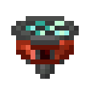
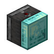
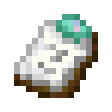
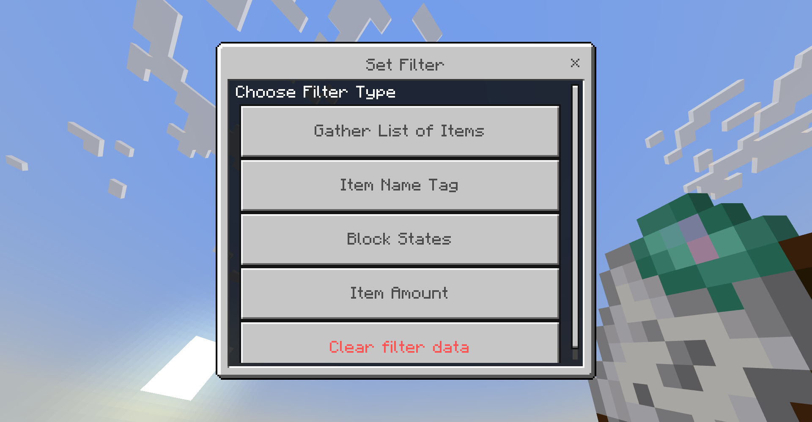

# The Advanced System
## Video

<iframe width="560" height="315" src="https://www.youtube.com/embed/yUkLN2ekkwk" title="" frameBorder="0"   allow="accelerometer; autoplay; clipboard-write; encrypted-media; gyroscope; picture-in-picture; web-share"  allowFullScreen></iframe>

## Simplified Transcript <Badge type="tip" text="Written by chatgpt cuz i can't bother" />

Advanced Filters are a new addition to Vanilla Upgrade, introducing two improved blocks: the Advanced Hopper and the Advanced Observer. These blocks make automation easier by allowing more control over what they interact with.

### [Advanced Hopper](/blocks/functional.html#advanced-hopper) </img>
This is a faster version of the regular Hopper with clear indicators. It can be set to accept only specific items, making sorting much more efficient.

### [Advanced Observer](/blocks/functional.html#advanced-observer) </img>
Unlike a normal Observer, this one can detect specific blocks, not just block updates. This makes it more useful for precise redstone setups.

### Filtering Features
Both blocks support filtering, which you can set by interacting with them while holding an item. For example, an Advanced Hopper can be configured to only accept certain items, and an Advanced Observer can be set to detect only certain blocks.

### [Advanced Filter](/items/tools.html#advanced-filter) Options </img>
When you open an Advanced Filter, you’ll see several filtering options:

- Item List – Select specific items from your inventory. The Hopper will only accept these.
- Name Tag – Enter an item’s name to filter only items with that exact name.
- Block State – Copy a block’s state (like whether a door is open or closed) and filter based on that.
- Item Amount – Set a threshold (e.g., only accept stacks larger than 20).
</img>

### Copying Filters
If you’ve set up a filter and want to use it on another block, you can copy it. Just interact with the filter, choose Copy, and apply it to a new filter. This makes it easy to reuse complex setups.