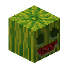

# Decoration Blocks

## Blue Nether Bricks

`vc:blue_nether_bricks`
| Component | Value |
|---|---|
|Breaking time (secs)|5|
|Luminous|No|
|Blast resistance|_Not Set_|
|Flammable|No|
|Conducts Redstone|No|

### About:

## Blue Nether Brick Stairs

`vc:blue_nether_brick_stairs`
| Component | Value |
|---|---|
|Breaking time (secs)|10|
|Luminous|No|
|Blast resistance|_Not Set_|
|Flammable|No|
|Conducts Redstone|No|
|Waterloggable|Yes|
|Placement Style|Directional|

### About:

## Blue Nether Brick Slab

`vc:blue_nether_brick_slab`
| Component | Value |
|---|---|
|Breaking time (secs)|10|
|Luminous|No|
|Blast resistance|_Not Set_|
|Flammable|No|
|Conducts Redstone|No|
|Waterloggable|Yes|
|Placement Style|Directional|

### About:

## Bricks Carved

`vc:bricks_carved`
| Component | Value |
|---|---|
|Breaking time (secs)|1.1|
|Luminous|No|
|Blast resistance|_Not Set_|
|Flammable|No|
|Conducts Redstone|No|

### About:

## Carved Mellon

`vc:carved_mellon`
| Component | Value |
|---|---|
|Breaking time (secs)|3|
|Luminous|No|
|Blast resistance|_Not Set_|
|Flammable|No|
|Conducts Redstone|No|
|Placement Style|Directional|

### About:

## Carved Mellon Speckled

`vc:carved_mellon_speckled`
| Component | Value |
|---|---|
|Breaking time (secs)|3|
|Luminous|No|
|Blast resistance|_Not Set_|
|Flammable|No|
|Conducts Redstone|No|
|Placement Style|Directional|

### About:

## Charred Rock

`vc:charred_rock`
| Component | Value |
|---|---|
|Breaking time (secs)|20|
|Luminous|No|
|Blast resistance|9|
|Flammable|No|
|Conducts Redstone|No|

### About:

## Dirt Stairs

`vc:dirt_stairs`
| Component | Value |
|---|---|
|Breaking time (secs)|3|
|Luminous|No|
|Blast resistance|_Not Set_|
|Flammable|No|
|Conducts Redstone|No|
|Placement Style|Directional|

### About:

## Dirt Slab

`vc:dirt_slab`
| Component | Value |
|---|---|
|Breaking time (secs)|3|
|Luminous|No|
|Blast resistance|_Not Set_|
|Flammable|No|
|Conducts Redstone|No|
|Placement Style|Positional|

### About:

## Endslate Bricks

`vc:endslate_bricks`
| Component | Value |
|---|---|
|Breaking time (secs)|20|
|Luminous|No|
|Blast resistance|9|
|Flammable|No|
|Conducts Redstone|No|

### About:

## Endslate Bricks Cracked

`vc:endslate_bricks_cracked`
| Component | Value |
|---|---|
|Breaking time (secs)|20|
|Luminous|No|
|Blast resistance|9|
|Flammable|No|
|Conducts Redstone|No|

### About:

## End Bricks Cracked

`vc:end_bricks_cracked`
| Component | Value |
|---|---|
|Breaking time (secs)|15|
|Luminous|No|
|Blast resistance|9|
|Flammable|No|
|Conducts Redstone|No|

### About:

## Soul Jack o' Lantern

`vc:lit_pumpkin_soul`
| Component | Value |
|---|---|
|Breaking time (secs)|3|
|Luminous|No|
|Blast resistance|_Not Set_|
|Flammable|No|
|Conducts Redstone|No|
|Placement Style|Directional|

### About:

## Quartz Brick Stairs

`vc:quartz_brick_stairs`
| Component | Value |
|---|---|
|Breaking time (secs)|4|
|Luminous|No|
|Blast resistance|0.8|
|Flammable|No|
|Conducts Redstone|No|
|Placement Style|Directional|

### About:

## Quartz Brick Slab

`vc:quartz_brick_slab`
| Component | Value |
|---|---|
|Breaking time (secs)|4|
|Luminous|No|
|Blast resistance|0.8|
|Flammable|No|
|Conducts Redstone|No|
|Placement Style|Directional|

### About:

## Rainbow Carpet

`vc:rainbow_carpet`
| Component | Value |
|---|---|
|Breaking time (secs)|0.15|
|Luminous|No|
|Blast resistance|0|
|Flammable|Yes (30)|
|Conducts Redstone|No|

### About:

## Rainbow Wool

`vc:rainbow_wool`
| Component | Value |
|---|---|
|Breaking time (secs)|1.2|
|Luminous|No|
|Blast resistance|0|
|Flammable|Yes (30)|
|Conducts Redstone|No|

### About:

## Silver Birch Leaves

`vc:silver_birch_leaves`
| Component | Value |
|---|---|
|Breaking time (secs)|1.1|
|Luminous|No|
|Blast resistance|_Not Set_|
|Flammable|Yes (5)|
|Conducts Redstone|No|

### About:

## Silver Birch Trailings

`vc:silver_birch_trailings`
| Component | Value |
|---|---|
|Breaking time (secs)|1.1|
|Luminous|No|
|Blast resistance|_Not Set_|
|Flammable|Yes (5)|
|Conducts Redstone|No|

### About:
