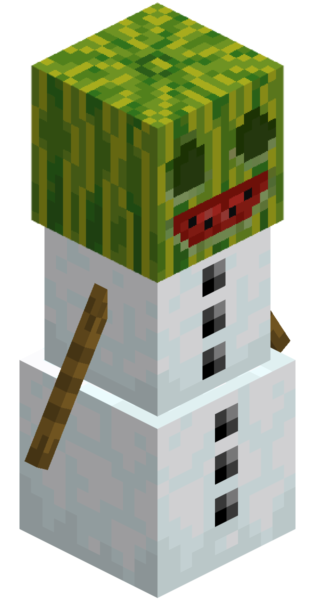
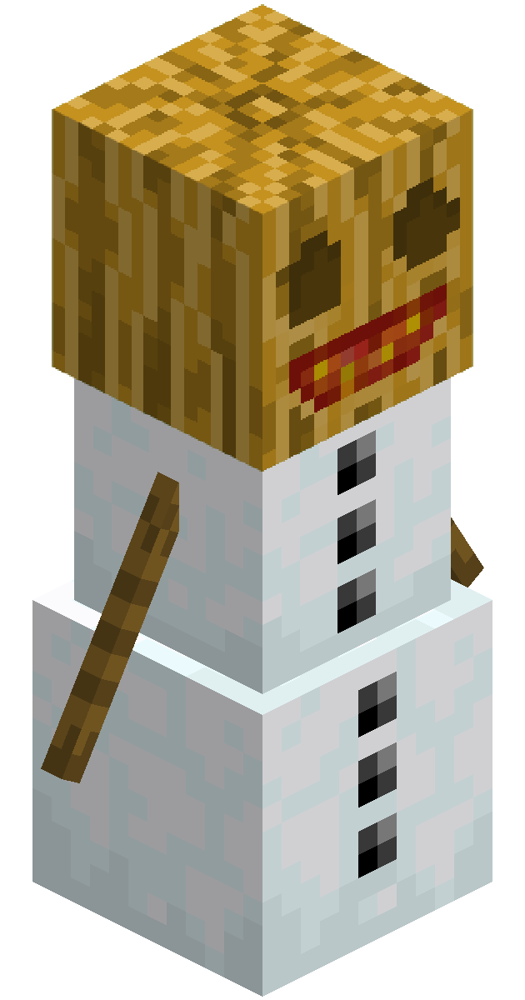

# Decoration Blocks

## Blue Nether Bricks

  <label class="radioswitcher">
    <input type="radio" name="radioswitcher" v-model="selectedBNB" value="1">
        

Block
  </label>
  <label class="radioswitcher">
    <input type="radio" name="radioswitcher" v-model="selectedBNB" value="2">
        

Stairs
  </label>
  <label class="radioswitcher">
    <input type="radio" name="radioswitcher" v-model="selectedBNB" value="3">
        

Slab
  </label>
  <label class="radioswitcher">
    <input type="radio" name="radioswitcher" v-model="selectedBNB" value="4">
        

Wall
  </label>

<!-- Transition Wrapper for Collapsible Info Box -->
<transition name="slide">
  

</transition>

**Blue Nether Bricks** are a blue variant of [Nether Bricks](https://minecraft.wiki/w/Nether_Bricks) that originate from [Warped Warts](/items/crops.html#warped-wart)
- They are essentially the same as [Red Nether Bricks](https://minecraft.wiki/w/Red_Nether_Bricks)

## Carved Bricks

`vc:bricks_carved`
| Component | Value |
|---|---|
|Breaking time (secs)|1.1|
|Luminous|No|
|Blast resistance|_Not Set_|
|Flammable|No|
|Conducts Redstone|No|

### About:
Carved Bricks are a simple decoration block with a carving of a fox on its face.
### Crafting

    
 Carved Bricks  

  

    

    
 Brick Slab  

    
 

    
 

    
 Brick Slab  

  

## Carved Mellon

`vc:carved_mellon`
| Component | Value |
|---|---|
|Breaking time (secs)|3|
|Luminous|No|
|Blast resistance|_Not Set_|
|Flammable|No|
|Conducts Redstone|No|
|Placement Style|Directional|

### About:
Carved Melons come form Minecraft earth, they are worn by Melon Golems

Placing a Carved Melon on two snow blocks will spawn a melon golem

- they are created by shearing  a Melon Block 
- Their id is misspelled as "mellon" due to vlliage not knowing how to spell

## Speckled Carved Mellon

`vc:carved_mellon_speckled`
| Component | Value |
|---|---|
|Breaking time (secs)|3|
|Luminous|No|
|Blast resistance|_Not Set_|
|Flammable|No|
|Conducts Redstone|No|
|Placement Style|Directional|

### About:
Speckled Carved Melons are a variant of the Carved Melon they are worn by Melon Golems

Placing a Speckled Carved Melon on two snow blocks will spawn a snow golem with a Speckled Carved Melon

- they are created by shearing  a Speckled Melon Block 
- Their id is misspelled as "mellon" due to vlliage not knowing how to spell

## Charred Rock

`vc:charred_rock`
| Component | Value |
|---|---|
|Breaking time (secs)|20|
|Luminous|No|
|Blast resistance|9|
|Flammable|No|
|Conducts Redstone|No|

### About:
*Charred Rocks* are the structure of [Nether Springs](/features.html#nether-springs) found in lava lakes.
- They typically do not spawn anywhere else in the nether
-  [Aloe Plants](/items/crops.html#aloe-plant) can grow on these
- They are extremely brittle, hence not being able to be crafted with

## Dirt

  <label class="radioswitcher">
    <input type="radio" name="radioswitcher" v-model="selectedDIRT" value="1">
        

Stairs
  </label>
  <label class="radioswitcher">
    <input type="radio" name="radioswitcher" v-model="selectedDIRT" value="2">
        

Slab
  </label>

<!-- Transition Wrapper for Collapsible Info Box -->
<transition name="slide">
  

</transition>

**Dirt Slabs** and **Stairs** are simply [Dirt](https://minecraft.wiki/w/Dirt) blocks in stair and slab form
- They have almost the exact same stats of normal dirt block

## Endslate Bricks

 

<code data-v-4a89f8d7="">vc:endslate_bricks</code>

<code data-v-4a89f8d7="">vc:endslate_bricks_cracked</code>

| Component | Value |
|---|---|
|Breaking time (secs)|20|
|Luminous|No|
|Blast resistance|9|
|Flammable|No|
|Conducts Redstone|No|

### About:
**Endlate bricks** are  [Endslate](/blocks/misc.html#endslate) based brick blocks
- Unlike their [End Stone](https://minecraft.wiki/w/End_Stone_Bricks) counterpart, they come with a cracked variant
  - To compensate, [End stone was also given a cracked variant](/blocks/deco.html#end-bricks-cracked)
  
### Crafting

    
 Endslate Bricks  

  

    
Endslate 

    
Endslate 

    
 

    
Endslate 

    
Endslate 

  

    
 Cracked Endslate Bricks  

    
 Endslate Bricks  

    
 Any Fuel  

## End Bricks Cracked

`vc:end_bricks_cracked`
| Component | Value |
|---|---|
|Breaking time (secs)|15|
|Luminous|No|
|Blast resistance|9|
|Flammable|No|
|Conducts Redstone|No|

### About:
Because [End Stone Bricks](https://minecraft.wiki/w/End_Stone_Bricks) didnt have a cracked variant in the Vanilla Game, they were given one.
- They have the exact same stats as their vanilla counterpart

### Smelting

    
 Cracked End Stone Bricks  

    
 End Stone Bricks  

    
 Any Fuel  

## Glass Door

`vc:glass_door`
| Component | Value |
|---|---|
|Breaking time (secs)|0.45|
|Luminous|No|
|Blast resistance|_Not Set_|
|Flammable|Yes (5)|
|Conducts Redstone|No|
|Placement Style|Directional|

### About:
**Glass Doors** are a [Glass](https://minecraft.wiki/w/Glass) based door
- Glass doors cannot be opened by redstone
  - This was a intnetional feature. However, due to lag, all Vanilla Upgrade doors do not work with redstone.
    - This was changed as of v3.1.0
  
### Crafting:

    
 Glass Door 

  

    
Glass 

    
Glass 

    
 

    
Glass 

    
Glass 

    
 

    
Glass 

    
Glass 

  

## Glass Trapdoor

`vc:glass_trapdoor`
| Component | Value |
|---|---|
|Breaking time (secs)|3|
|Luminous|No|
|Blast resistance|_Not Set_|
|Flammable|Yes (5)|
|Conducts Redstone|No|
|Placement Style|Directional|

### About:
**Glass Trapdoors** are a [Glass](https://minecraft.wiki/w/Glass) based trapdoor
- Glass Trapdoors cannot be opened by redstone
  - This was a intnetional feature. However, due to lag, all Vanilla Upgrade trapdoors do not work with redstone.
  
### Crafting:

    
 Glass Trapdoor 

  

    
Glass 

    
Glass 

    
 

    
Glass 

    
Glass 

  

## Snow Bricks

  <label class="radioswitcher">
    <input type="radio" name="radioswitcher" v-model="selectedSB" value="1">
        

Block
  </label>
  <label class="radioswitcher">
    <input type="radio" name="radioswitcher" v-model="selectedSB" value="2">
        

Stairs
  </label>
  <label class="radioswitcher">
    <input type="radio" name="radioswitcher" v-model="selectedSB" value="3">
        

Slab
  </label>
  <label class="radioswitcher">
    <input type="radio" name="radioswitcher" v-model="selectedSB" value="4">
        

Wall
  </label>

<transition name="slide">
  

</transition>

**Snow Bricks** are a set packed down blocks of Snow that can be used for construction.

## Soul Jack o' Lantern

`vc:lit_pumpkin_soul`
| Component | Value |
|---|---|
|Breaking time (secs)|3|
|Luminous|No|
|Blast resistance|_Not Set_|
|Flammable|No|
|Conducts Redstone|No|
|Placement Style|Directional|

### About:
**Soul Jack o' Lanterns** are a variant of the [Jack o' Lantern]() crafted with a soul torch

### Crafting:

    
 Soul Jack o' Lantern 

  

    

    
Carved Pumpkin 

    
 

    
 

    
Soul Torch 

  

## Quartz Brick Stairs, Slab, and Wall

 

<code data-v-4a89f8d7="">vc:quartz_brick_stairs</code>

<code data-v-4a89f8d7="">vc:quartz_brick_slab</code>

<code data-v-4a89f8d7="">vc:quartz_brick_wall</code>

| Component | Value |
|---|---|
|Breaking time (secs)|4|
|Luminous|No|
|Blast resistance|0.8|
|Flammable|No|
|Conducts Redstone|No|
|Placement Style|Directional|

### About:
**Quartz Brick Stairs and Slabs** are simple stair, slab and wall variants of [Quartz Bricks](https://minecraft.wiki/w/Quartz_Bricks)

### Crafting:

    
 Quartz Brick Stairs 

  

    
Quartz Bricks 

    
 

    
 

    
Quartz Bricks 

    
Quartz Bricks 

    
 

    
Quartz Bricks 

    
Quartz Bricks 

    
Quartz Bricks 

  

    
 Quartz Brick Slab 

  

    
 

    
 

    
 

    
 

    
 

    
 

    
Quartz Bricks 

    
Quartz Bricks 

    
Quartz Bricks 

  

    
 Quartz Brick Wall 

  

    
 

    
 

    
 

    
Quartz Bricks 

    
Quartz Bricks 

    
Quartz Bricks 

    
Quartz Bricks 

    
Quartz Bricks 

    
Quartz Bricks 

  

## jeb_ Wool and Carpet

 

<code data-v-4a89f8d7="">vc:rainbow_wool</code>

<code data-v-4a89f8d7="">vc:rainbow_carpet</code>

| Component | Value |
|---|---|
|Breaking time (secs)|1.2 (Wool) 0.15 (Carpet)|
|Luminous|No|
|Blast resistance|0|
|Flammable|Yes (30)|
|Conducts Redstone|No|

### About:
**jeb_ Wool** (aka Rainbow Wool) is a new wool color sheared from sheep named "[jeb_](https://minecraft.wiki/w/Sheep#Easter_eggs)"

### Crafting:

    
 jeb_ Carpet 

  

    
 

    
 

    
 

    
 

    
 

    
 

    
jeb_ Wool 

    
jeb_ Wool 

  

## Silver Birch Leaves

`vc:silver_birch_leaves`
| Component | Value |
|---|---|
|Breaking time (secs)|1.1|
|Luminous|No|
|Blast resistance|_Not Set_|
|Flammable|Yes (5)|
|Conducts Redstone|No|

### About:
**Silver Birch Leaves** are a special [Birch Leaf](https://minecraft.wiki/w/Leaves#Birch) variant that are yellow
- They are inspired by [Real Birch trees that turn yellow in autumn](https://en.wikipedia.org/wiki/Betula_pendula)

## Silver Birch Trailings

`vc:silver_birch_trailings`
| Component | Value |
|---|---|
|Breaking time (secs)|1.1|
|Luminous|No|
|Blast resistance|_Not Set_|
|Flammable|Yes (5)|
|Conducts Redstone|No|

### About:
**Silver Birch Trailings** stem off the bottom of [Silver Birch Leaves](/blocks/deco.html#silver-birch-leaves)
- Their only purpose is to make the tree pretty lol

## Withered Bone Block

`vc:wither_bone_block`
| Component | Value |
|---|---|
|Breaking time (secs)|10|
|Luminous|No|
|Blast resistance|2|
|Flammable|No|
|Conducts Redstone|No|
|Placement Style|Directional|

### About:
**Withered Bone Block** is the wither variant of the [Bone Block](https://minecraft.wiki/w/Bone_Block)

### Crafting:

    
 Withered Bone Block 

  

    
Withered Bone Meal 

    
Withered Bone Meal 

    
Withered Bone Meal 

    
Withered Bone Meal 

    
Withered Bone Meal 

    
Withered Bone Meal 

    
Withered Bone Meal 

    
Withered Bone Meal 

    
Withered Bone Meal 

  

