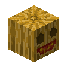

# Decoration Blocks

## Blue Nether Bricks

  <label class="radioswitcher">
    <input type="radio" name="radioswitcher" v-model="selectedBNB" value="1">
        

Block
  </label>
  <label class="radioswitcher">
    <input type="radio" name="radioswitcher" v-model="selectedBNB" value="2">
        

Stairs
  </label>
  <label class="radioswitcher">
    <input type="radio" name="radioswitcher" v-model="selectedBNB" value="3">
        

Slab
  </label>

<!-- Transition Wrapper for Collapsible Info Box -->
<transition name="slide">
  

</transition>

## Bricks Carved

`vc:bricks_carved`
| Component | Value |
|---|---|
|Breaking time (secs)|1.1|
|Luminous|No|
|Blast resistance|_Not Set_|
|Flammable|No|
|Conducts Redstone|No|

### About:

## Carved Mellon

`vc:carved_mellon`
| Component | Value |
|---|---|
|Breaking time (secs)|3|
|Luminous|No|
|Blast resistance|_Not Set_|
|Flammable|No|
|Conducts Redstone|No|
|Placement Style|Directional|

### About:

## Carved Mellon Speckled

`vc:carved_mellon_speckled`
| Component | Value |
|---|---|
|Breaking time (secs)|3|
|Luminous|No|
|Blast resistance|_Not Set_|
|Flammable|No|
|Conducts Redstone|No|
|Placement Style|Directional|

### About:

## Charred Rock

`vc:charred_rock`
| Component | Value |
|---|---|
|Breaking time (secs)|20|
|Luminous|No|
|Blast resistance|9|
|Flammable|No|
|Conducts Redstone|No|

### About:

## Dirt

  <label class="radioswitcher">
    <input type="radio" name="radioswitcher" v-model="selectedDIRT" value="1">
        

Stairs
  </label>
  <label class="radioswitcher">
    <input type="radio" name="radioswitcher" v-model="selectedDIRT" value="2">
        

Slab
  </label>

<!-- Transition Wrapper for Collapsible Info Box -->
<transition name="slide">
  

</transition>

## Endslate Bricks

 

<code data-v-4a89f8d7="">vc:endslate_bricks</code>

<code data-v-4a89f8d7="">vc:endslate_bricks_cracked</code>

| Component | Value |
|---|---|
|Breaking time (secs)|20|
|Luminous|No|
|Blast resistance|9|
|Flammable|No|
|Conducts Redstone|No|

### About:

## End Bricks Cracked

`vc:end_bricks_cracked`
| Component | Value |
|---|---|
|Breaking time (secs)|15|
|Luminous|No|
|Blast resistance|9|
|Flammable|No|
|Conducts Redstone|No|

### About:

## Glass Door

`vc:glass_door`
| Component | Value |
|---|---|
|Breaking time (secs)|2.5|
|Luminous|No|
|Blast resistance|_Not Set_|
|Flammable|Yes (5)|
|Conducts Redstone|No|
|Placement Style|Directional|

### About:

## Glass Trapdoor

`vc:glass_trapdoor`
| Component | Value |
|---|---|
|Breaking time (secs)|3|
|Luminous|No|
|Blast resistance|_Not Set_|
|Flammable|Yes (5)|
|Conducts Redstone|No|
|Placement Style|Directional|

### About:

## Soul Jack o' Lantern

`vc:lit_pumpkin_soul`
| Component | Value |
|---|---|
|Breaking time (secs)|3|
|Luminous|No|
|Blast resistance|_Not Set_|
|Flammable|No|
|Conducts Redstone|No|
|Placement Style|Directional|

### About:

## Quartz Brick Stairs and Slab

 

<code data-v-4a89f8d7="">vc:quartz_brick_stairs</code>

<code data-v-4a89f8d7="">vc:quartz_brick_slab</code>

| Component | Value |
|---|---|
|Breaking time (secs)|4|
|Luminous|No|
|Blast resistance|0.8|
|Flammable|No|
|Conducts Redstone|No|
|Placement Style|Directional|

### About:

## Rainbow Wool and Carpet

 

<code data-v-4a89f8d7="">vc:rainbow_wool</code>

<code data-v-4a89f8d7="">vc:rainbow_carpet</code>

| Component | Value |
|---|---|
|Breaking time (secs)|1.2 (Wool) 0.15 (Carpet)|
|Luminous|No|
|Blast resistance|0|
|Flammable|Yes (30)|
|Conducts Redstone|No|

### About:

## Silver Birch Leaves

`vc:silver_birch_leaves`
| Component | Value |
|---|---|
|Breaking time (secs)|1.1|
|Luminous|No|
|Blast resistance|_Not Set_|
|Flammable|Yes (5)|
|Conducts Redstone|No|

### About:

## Silver Birch Trailings

`vc:silver_birch_trailings`
| Component | Value |
|---|---|
|Breaking time (secs)|1.1|
|Luminous|No|
|Blast resistance|_Not Set_|
|Flammable|Yes (5)|
|Conducts Redstone|No|

### About:

