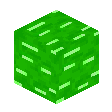
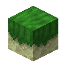
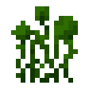
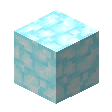
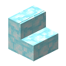
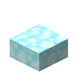

# Blocks Families

::: details Azalea Wood 

## Azalea Door

`vc:azalea_door`
| Component | Value |
|---|---|
|Breaking time (secs)|2.5|
|Luminous|No|
|Blast resistance|_Not Set_|
|Flammable|Yes (5)|
|Conducts Redstone|No|
|Placement Style|Directional|

### About:

## Azalea Fence

`vc:azalea_fence`
| Component | Value |
|---|---|
|Breaking time (secs)|2.5|
|Luminous|No|
|Blast resistance|_Not Set_|
|Flammable|Yes (5)|
|Conducts Redstone|No|

### About:

## Azalea Fence Gate

`vc:azalea_fence_gate`
| Component | Value |
|---|---|
|Breaking time (secs)|2.5|
|Luminous|No|
|Blast resistance|_Not Set_|
|Flammable|Yes (5)|
|Conducts Redstone|No|
|Placement Style|Directional|

### About:

## Azalea Log

`vc:azalea_log`
| Component | Value |
|---|---|
|Breaking time (secs)|1.1|
|Luminous|No|
|Blast resistance|0|
|Flammable|No|
|Conducts Redstone|No|
|Placement Style|Positional|

### About:

## Azalea Planks

`vc:azalea_planks`
| Component | Value |
|---|---|
|Breaking time (secs)|3|
|Luminous|No|
|Blast resistance|_Not Set_|
|Flammable|Yes (5)|
|Conducts Redstone|No|

### About:

## Azalea Stairs

`vc:azalea_stairs`
| Component | Value |
|---|---|
|Breaking time (secs)|3|
|Luminous|No|
|Blast resistance|_Not Set_|
|Flammable|Yes (5)|
|Conducts Redstone|No|
|Placement Style|Directional|

### About:

## Azalea Slab

`vc:azalea_slab`
| Component | Value |
|---|---|
|Breaking time (secs)|3|
|Luminous|No|
|Blast resistance|_Not Set_|
|Flammable|Yes (5)|
|Conducts Redstone|No|
|Placement Style|Directional|

### About:

## Azalea Trapdoor

`vc:azalea_trapdoor`
| Component | Value |
|---|---|
|Breaking time (secs)|3|
|Luminous|No|
|Blast resistance|_Not Set_|
|Flammable|Yes (5)|
|Conducts Redstone|No|
|Placement Style|Directional|

### About:

## Azalea Wood

`vc:azalea_wood`
| Component | Value |
|---|---|
|Breaking time (secs)|1.1|
|Luminous|No|
|Blast resistance|0|
|Flammable|No|
|Conducts Redstone|No|
|Placement Style|Positional|

### About:

## Stripped Azalea Log

`vc:stripped_azalea_log`
| Component | Value |
|---|---|
|Breaking time (secs)|1.1|
|Luminous|No|
|Blast resistance|0|
|Flammable|No|
|Conducts Redstone|No|
|Placement Style|Positional|

### About:

## Stripped Azalea Wood

`vc:stripped_azalea_wood`
| Component | Value |
|---|---|
|Breaking time (secs)|1.1|
|Luminous|No|
|Blast resistance|0|
|Flammable|No|
|Conducts Redstone|No|
|Placement Style|Positional|

### About:
:::

::: details Elax Wood/Biome 

## Zalu Block

`vc:zalu_block`
| Component | Value |
|---|---|
|Breaking time (secs)|5|
|Luminous|No|
|Blast resistance|9|
|Flammable|No|
|Conducts Redstone|No|

### About:

## Zalu Plant

`vc:zalu_plant`
| Component | Value |
|---|---|
|Breaking time (secs)|0.1|
|Luminous|Yes (3)|
|Blast resistance|_Not Set_|
|Flammable|No|
|Conducts Redstone|No|

### About:

## Zalu Roots

`vc:zalu_roots`
| Component | Value |
|---|---|
|Breaking time (secs)|0.1|
|Luminous|Yes (1)|
|Blast resistance|_Not Set_|
|Flammable|No|
|Conducts Redstone|No|

### About:

## Elax Fence

`vc:elax_fence`
| Component | Value |
|---|---|
|Breaking time (secs)|2.5|
|Luminous|No|
|Blast resistance|_Not Set_|
|Flammable|Yes (5)|
|Conducts Redstone|No|

### About:

## Elax Fence Gate

`vc:elax_fence_gate`
| Component | Value |
|---|---|
|Breaking time (secs)|2.5|
|Luminous|No|
|Blast resistance|_Not Set_|
|Flammable|Yes (5)|
|Conducts Redstone|No|
|Placement Style|Directional|

### About:

## Elax Floor Leaves

`vc:elax_floor_leaves`
| Component | Value |
|---|---|
|Breaking time (secs)|0.3|
|Luminous|No|
|Blast resistance|0|
|Flammable|No|
|Conducts Redstone|No|

### About:

## Elax Fungus

`vc:elax_fungus`
| Component | Value |
|---|---|
|Breaking time (secs)|1.1|
|Luminous|No|
|Blast resistance|0|
|Flammable|No|
|Conducts Redstone|No|

### About:

## Elax Fungus Crystalized

`vc:elax_fungus_crystalized`
| Component | Value |
|---|---|
|Breaking time (secs)|1.1|
|Luminous|Yes (3)|
|Blast resistance|0|
|Flammable|No|
|Conducts Redstone|No|

### About:

## Elax Leaves

`vc:elax_leaves`
| Component | Value |
|---|---|
|Breaking time (secs)|1.1|
|Luminous|No|
|Blast resistance|0|
|Flammable|No|
|Conducts Redstone|No|

### About:

## Elax Log

`vc:elax_log`
| Component | Value |
|---|---|
|Breaking time (secs)|1.1|
|Luminous|No|
|Blast resistance|0|
|Flammable|No|
|Conducts Redstone|No|
|Placement Style|Positional|

### About:

## Elax Planks

`vc:elax_planks`
| Component | Value |
|---|---|
|Breaking time (secs)|3|
|Luminous|No|
|Blast resistance|_Not Set_|
|Flammable|Yes (5)|
|Conducts Redstone|No|

### About:

## Elax Slab

`vc:elax_slab`
| Component | Value |
|---|---|
|Breaking time (secs)|3|
|Luminous|No|
|Blast resistance|6|
|Flammable|No|
|Conducts Redstone|No|
|Placement Style|Positional|

### About:

## Elax Stairs

`vc:elax_stairs`
| Component | Value |
|---|---|
|Breaking time (secs)|3|
|Luminous|No|
|Blast resistance|_Not Set_|
|Flammable|Yes (5)|
|Conducts Redstone|No|
|Placement Style|Directional|

### About:

## Elax Trapdoor

`vc:elax_trapdoor`
| Component | Value |
|---|---|
|Breaking time (secs)|3|
|Luminous|No|
|Blast resistance|_Not Set_|
|Flammable|Yes (5)|
|Conducts Redstone|No|
|Placement Style|Directional|

### About:

## Elax Wood

`vc:elax_wood`
| Component | Value |
|---|---|
|Breaking time (secs)|1.1|
|Luminous|No|
|Blast resistance|0|
|Flammable|No|
|Conducts Redstone|No|
|Placement Style|Positional|

### About:

## Stripped Elax Log

`vc:stripped_elax_log`
| Component | Value |
|---|---|
|Breaking time (secs)|1.1|
|Luminous|No|
|Blast resistance|0|
|Flammable|No|
|Conducts Redstone|No|
|Placement Style|Positional|

### About:

## Stripped Elax Wood

`vc:stripped_elax_wood`
| Component | Value |
|---|---|
|Breaking time (secs)|1.1|
|Luminous|No|
|Blast resistance|0|
|Flammable|No|
|Conducts Redstone|No|
|Placement Style|Positional|

### About:

## Elax Door

`vc:elax_door`
| Component | Value |
|---|---|
|Breaking time (secs)|2.5|
|Luminous|No|
|Blast resistance|_Not Set_|
|Flammable|Yes (5)|
|Conducts Redstone|No|
|Placement Style|Directional|

### About:

## Elax Sapling

`vc:sapling_elax`
| Component | Value |
|---|---|
|Breaking time (secs)|0.5|
|Luminous|No|
|Blast resistance|_Not Set_|
|Flammable|Yes (5)|
|Conducts Redstone|No|

### About:

:::
::: details Palm Wood 

## Palm Fence

`vc:palm_fence`
| Component | Value |
|---|---|
|Breaking time (secs)|2.5|
|Luminous|No|
|Blast resistance|_Not Set_|
|Flammable|Yes (5)|
|Conducts Redstone|No|

### About:

## Palm Fence Gate

`vc:palm_fence_gate`
| Component | Value |
|---|---|
|Breaking time (secs)|2.5|
|Luminous|No|
|Blast resistance|_Not Set_|
|Flammable|Yes (5)|
|Conducts Redstone|No|
|Placement Style|Directional|

### About:

## Palm Leaves

`vc:palm_leaves`
| Component | Value |
|---|---|
|Breaking time (secs)|3|
|Luminous|No|
|Blast resistance|_Not Set_|
|Flammable|No|
|Conducts Redstone|No|

### About:

## Palm Log

`vc:palm_log`
| Component | Value |
|---|---|
|Breaking time (secs)|1.1|
|Luminous|No|
|Blast resistance|0|
|Flammable|No|
|Conducts Redstone|No|
|Placement Style|Positional|

### About:

## Palm Planks

`vc:palm_planks`
| Component | Value |
|---|---|
|Breaking time (secs)|3|
|Luminous|No|
|Blast resistance|_Not Set_|
|Flammable|Yes (5)|
|Conducts Redstone|No|

### About:

## Palm Stairs

`vc:palm_stairs`
| Component | Value |
|---|---|
|Breaking time (secs)|3|
|Luminous|No|
|Blast resistance|_Not Set_|
|Flammable|Yes (5)|
|Conducts Redstone|No|
|Placement Style|Directional|

### About:

## Palm Slab

`vc:palm_slab`
| Component | Value |
|---|---|
|Breaking time (secs)|3|
|Luminous|No|
|Blast resistance|_Not Set_|
|Flammable|Yes (5)|
|Conducts Redstone|No|
|Placement Style|Directional|

### About:

## Palm Trailings

`vc:palm_trailings`
| Component | Value |
|---|---|
|Breaking time (secs)|1.1|
|Luminous|No|
|Blast resistance|0|
|Flammable|Yes (5)|
|Conducts Redstone|No|

### About:

## Palm Trapdoor

`vc:palm_trapdoor`
| Component | Value |
|---|---|
|Breaking time (secs)|3|
|Luminous|No|
|Blast resistance|_Not Set_|
|Flammable|Yes (5)|
|Conducts Redstone|No|
|Placement Style|Directional|

### About:

## Palm Wood

`vc:palm_wood`
| Component | Value |
|---|---|
|Breaking time (secs)|1.1|
|Luminous|No|
|Blast resistance|0|
|Flammable|No|
|Conducts Redstone|No|
|Placement Style|Positional|

### About:

## Stripped Palm Log

`vc:stripped_palm_log`
| Component | Value |
|---|---|
|Breaking time (secs)|1.1|
|Luminous|No|
|Blast resistance|0|
|Flammable|No|
|Conducts Redstone|No|
|Placement Style|Positional|

### About:

## Stripped Palm Wood

`vc:stripped_palm_wood`
| Component | Value |
|---|---|
|Breaking time (secs)|1.1|
|Luminous|No|
|Blast resistance|0|
|Flammable|No|
|Conducts Redstone|No|
|Placement Style|Positional|

### About:

## Palm Sapling

`vc:sapling_palm`
| Component | Value |
|---|---|
|Breaking time (secs)|0.5|
|Luminous|No|
|Blast resistance|_Not Set_|
|Flammable|Yes (5)|
|Conducts Redstone|No|

### About:

:::
::: details Compressed Copper 

## Compressed Copper Bars

`vc:compressed_copper_bars`
| Component | Value |
|---|---|
|Breaking time (secs)|6.5|
|Luminous|No|
|Blast resistance|_Not Set_|
|Flammable|No|
|Conducts Redstone|No|

### About:

## Compressed Copper Block

`vc:compressed_copper_block`
| Component | Value |
|---|---|
|Breaking time (secs)|25|
|Luminous|No|
|Blast resistance|_Not Set_|
|Flammable|No|
|Conducts Redstone|No|

### About:

## Compressed Copper Door

`vc:compressed_copper_door`
| Component | Value |
|---|---|
|Breaking time (secs)|2.5|
|Luminous|No|
|Blast resistance|_Not Set_|
|Flammable|Yes (5)|
|Conducts Redstone|Yes|
|Placement Style|Directional|

### About:

## Compressed Copper Stairs

`vc:compressed_copper_stairs`
| Component | Value |
|---|---|
|Breaking time (secs)|25|
|Luminous|No|
|Blast resistance|_Not Set_|
|Flammable|Yes (5)|
|Conducts Redstone|No|
|Placement Style|Directional|

### About:

## Compressed Copper Slab

`vc:compressed_copper_slab`
| Component | Value |
|---|---|
|Breaking time (secs)|25|
|Luminous|No|
|Blast resistance|_Not Set_|
|Flammable|Yes (5)|
|Conducts Redstone|No|
|Placement Style|Directional|

### About:

## Compressed Copper Tiles

`vc:compressed_copper_tiles`
| Component | Value |
|---|---|
|Breaking time (secs)|25|
|Luminous|No|
|Blast resistance|_Not Set_|
|Flammable|No|
|Conducts Redstone|No|

### About:

## Compressed Copper Trapdoor

`vc:compressed_copper_trapdoor`
| Component | Value |
|---|---|
|Breaking time (secs)|10|
|Luminous|No|
|Blast resistance|_Not Set_|
|Flammable|Yes (5)|
|Conducts Redstone|No|
|Placement Style|Directional|

### About:

:::
::: details Glorium Blocks 

## Deepslate Glowing Mycelium

`vc:deepslate_glowing_mycelium`
| Component | Value |
|---|---|
|Breaking time (secs)|10|
|Luminous|No|
|Blast resistance|_Not Set_|
|Flammable|No|
|Conducts Redstone|No|

### About:

## Glowing Mushroom

`no:glowing_mushroom`
| Component | Value |
|---|---|
|Breaking time (secs)|0.1|
|Luminous|Yes (5)|
|Blast resistance|_Not Set_|
|Flammable|No|
|Conducts Redstone|No|

### About:

## Glowing Mushroom Block

`vc:glowing_mushroom_block`
| Component | Value |
|---|---|
|Breaking time (secs)|0.3|
|Luminous|Yes (7)|
|Blast resistance|_Not Set_|
|Flammable|No|
|Conducts Redstone|No|

### About:

## Glowing Mycelium

`vc:glowing_mycelium`
| Component | Value |
|---|---|
|Breaking time (secs)|7.5|
|Luminous|No|
|Blast resistance|_Not Set_|
|Flammable|No|
|Conducts Redstone|No|

### About:

## Glowing Roots

`no:glowing_roots`
| Component | Value |
|---|---|
|Breaking time (secs)|0.1|
|Luminous|Yes (5)|
|Blast resistance|_Not Set_|
|Flammable|No|
|Conducts Redstone|No|

### About:

## Cut Discharged Gloricalium Block

`vc:cut_discharged_gloricalium_block`
| Component | Value |
|---|---|
|Breaking time (secs)|14|
|Luminous|No|
|Blast resistance|_Not Set_|
|Flammable|No|
|Conducts Redstone|No|

### About:

## Cut Gloricalium Block

`vc:cut_gloricalium_block`
| Component | Value |
|---|---|
|Breaking time (secs)|14|
|Luminous|Yes (1)|
|Blast resistance|_Not Set_|
|Flammable|No|
|Conducts Redstone|Yes|

### About:

## Discharged Gloricalium Block

`vc:discharged_gloricalium_block`
| Component | Value |
|---|---|
|Breaking time (secs)|14|
|Luminous|No|
|Blast resistance|_Not Set_|
|Flammable|No|
|Conducts Redstone|No|

### About:

## Discharged Gloricalium Grate

`vc:discharged_gloricalium_grate`
| Component | Value |
|---|---|
|Breaking time (secs)|14|
|Luminous|No|
|Blast resistance|_Not Set_|
|Flammable|No|
|Conducts Redstone|No|
|Waterloggable|Yes|

### About:

## Gloricalium Block

`vc:gloricalium_block`
| Component | Value |
|---|---|
|Breaking time (secs)|14|
|Luminous|Yes (1)|
|Blast resistance|_Not Set_|
|Flammable|No|
|Conducts Redstone|Yes|

### About:

## Gloricalium Grate

`vc:gloricalium_grate`
| Component | Value |
|---|---|
|Breaking time (secs)|14|
|Luminous|Yes (1)|
|Blast resistance|_Not Set_|
|Flammable|No|
|Conducts Redstone|No|
|Waterloggable|Yes|

### About:

## Glorium Crystals

`vc:glorium_crystals`
| Component | Value |
|---|---|
|Breaking time (secs)|10|
|Luminous|Yes (10)|
|Blast resistance|_Not Set_|
|Flammable|No|
|Conducts Redstone|No|
|Waterloggable|Yes|
|Placement Style|Positional|

### About:

## Glorium Crystals Medium

`vc:glorium_crystals_medium`
| Component | Value |
|---|---|
|Breaking time (secs)|10|
|Luminous|Yes (10)|
|Blast resistance|_Not Set_|
|Flammable|No|
|Conducts Redstone|No|
|Waterloggable|Yes|
|Placement Style|Positional|

### About:

## Glorium Crystals Small

`vc:glorium_crystals_small`
| Component | Value |
|---|---|
|Breaking time (secs)|10|
|Luminous|Yes (10)|
|Blast resistance|_Not Set_|
|Flammable|No|
|Conducts Redstone|No|
|Waterloggable|Yes|
|Placement Style|Positional|

### About:

## Glorium Crystals Tiny

`vc:glorium_crystals_tiny`
| Component | Value |
|---|---|
|Breaking time (secs)|10|
|Luminous|Yes (10)|
|Blast resistance|_Not Set_|
|Flammable|No|
|Conducts Redstone|No|
|Waterloggable|Yes|
|Placement Style|Positional|

### About:

## Glorium Crystal Block

`vc:glorium_crystal_block`
| Component | Value |
|---|---|
|Breaking time (secs)|5|
|Luminous|No|
|Blast resistance|_Not Set_|
|Flammable|No|
|Conducts Redstone|No|

### About:

## Glorium Crystal Block Budding

`vc:glorium_crystal_block_budding`
| Component | Value |
|---|---|
|Breaking time (secs)|5|
|Luminous|No|
|Blast resistance|_Not Set_|
|Flammable|No|
|Conducts Redstone|No|

### About:

:::
::: details Lumerison Blocks 

## Lumerison Fungus

`vc:lumerison_fungus`
| Component | Value |
|---|---|
|Breaking time (secs)|0.1|
|Luminous|Yes (5)|
|Blast resistance|_Not Set_|
|Flammable|No|
|Conducts Redstone|No|

### About:

## Lumerison Fungus Block

`vc:lumerison_fungus_block`
| Component | Value |
|---|---|
|Breaking time (secs)|1.1|
|Luminous|Yes (5)|
|Blast resistance|0|
|Flammable|No|
|Conducts Redstone|No|

### About:

## Lumerison Moss

`vc:lumerison_moss`
| Component | Value |
|---|---|
|Breaking time (secs)|15|
|Luminous|No|
|Blast resistance|9|
|Flammable|No|
|Conducts Redstone|No|

### About:

## Lumerison Roots

`vc:lumerison_roots`
| Component | Value |
|---|---|
|Breaking time (secs)|0.1|
|Luminous|Yes (1)|
|Blast resistance|_Not Set_|
|Flammable|No|
|Conducts Redstone|No|

### About:

:::
::: details Snow Bricks 

## Snow Bricks

`vc:snowbrick`
| Component | Value |
|---|---|
|Breaking time (secs)|5|
|Luminous|No|
|Blast resistance|_Not Set_|
|Flammable|No|
|Conducts Redstone|No|

### About:

## Snow Brick Stairs

`vc:snow_brick_stairs`
| Component | Value |
|---|---|
|Breaking time (secs)|5|
|Luminous|No|
|Blast resistance|_Not Set_|
|Flammable|No|
|Conducts Redstone|No|
|Placement Style|Directional|

### About:

## Snow Brick Slab

`vc:snow_brick_slab`
| Component | Value |
|---|---|
|Breaking time (secs)|5|
|Luminous|No|
|Blast resistance|_Not Set_|
|Flammable|No|
|Conducts Redstone|No|
|Placement Style|Directional|

### About:

:::
::: details Soul Sandstone 

## Soulbush

`vc:soulbush`
| Component | Value |
|---|---|
|Breaking time (secs)|0.1|
|Luminous|No|
|Blast resistance|_Not Set_|
|Flammable|No|
|Conducts Redstone|No|

### About:

## Soul Sandstone

`vc:soul_sandstone`
| Component | Value |
|---|---|
|Breaking time (secs)|10|
|Luminous|No|
|Blast resistance|_Not Set_|
|Flammable|No|
|Conducts Redstone|No|

### About:

## Soul Sandstone Carved

`vc:soul_sandstone_carved`
| Component | Value |
|---|---|
|Breaking time (secs)|10|
|Luminous|No|
|Blast resistance|_Not Set_|
|Flammable|No|
|Conducts Redstone|No|

### About:

## Soul Sandstone Cut

`vc:soul_sandstone_cut`
| Component | Value |
|---|---|
|Breaking time (secs)|10|
|Luminous|No|
|Blast resistance|_Not Set_|
|Flammable|No|
|Conducts Redstone|No|

### About:

## Soul Sandstone Smooth

`vc:soul_sandstone_smooth`
| Component | Value |
|---|---|
|Breaking time (secs)|10|
|Luminous|No|
|Blast resistance|_Not Set_|
|Flammable|No|
|Conducts Redstone|No|

### About:

## Soul Sandstone Stairs

`vc:soul_sandstone_stairs`
| Component | Value |
|---|---|
|Breaking time (secs)|10|
|Luminous|No|
|Blast resistance|_Not Set_|
|Flammable|Yes (5)|
|Conducts Redstone|No|
|Placement Style|Directional|

### About:

## Soul Sandstone Slab

`vc:soul_sandstone_slab`
| Component | Value |
|---|---|
|Breaking time (secs)|10|
|Luminous|No|
|Blast resistance|_Not Set_|
|Flammable|Yes (5)|
|Conducts Redstone|No|
|Placement Style|Directional|

### About:

:::