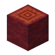
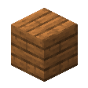
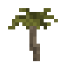
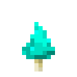
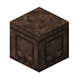
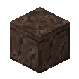
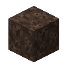

# Blocks Families
::: warning Incomplete Article
This article is incomplete! So it may lack details or crucial information.

**Reason: I *REALLY* dont want to add crafting recipies for all of these 😅** just use the recipie book >:3
:::

## Azalea Wood
<!--::: details Click to Expand  -->

  <label class="radioswitcher">
    <input type="radio" name="radioswitcher" v-model="selectedInfoa" value="option1">
    

Planks
  </label>
  <label class="radioswitcher">
    <input type="radio" name="radioswitcher" v-model="selectedInfoa" value="option2">
        

Stairs
  </label>
  <label class="radioswitcher">
    <input type="radio" name="radioswitcher" v-model="selectedInfoa" value="option3">
        

Slab
  </label>
  <label class="radioswitcher">
    <input type="radio" name="radioswitcher" v-model="selectedInfoa" value="option4">
        

Door
  </label>
  <label class="radioswitcher">
    <input type="radio" name="radioswitcher" v-model="selectedInfoa" value="option5">
        

Trapdoor
  </label>
  <label class="radioswitcher">
    <input type="radio" name="radioswitcher" v-model="selectedInfoa" value="option6">
        

Fence
  </label>
  <label class="radioswitcher">
    <input type="radio" name="radioswitcher" v-model="selectedInfoa" value="option7">
        

Fence Gate
  </label>
  <label class="radioswitcher">
    <input type="radio" name="radioswitcher" v-model="selectedInfoa" value="option8">
        

Log
  </label>
  <label class="radioswitcher">
    <input type="radio" name="radioswitcher" v-model="selectedInfoa" value="option9">
        

Wood
  </label>
  <label class="radioswitcher">
    <input type="radio" name="radioswitcher" v-model="selectedInfoa" value="option10">
        

Stripeped Log
  </label>
  <label class="radioswitcher">
    <input type="radio" name="radioswitcher" v-model="selectedInfoa" value="option11">
        

Stripped Wood
  </label>

<button @click="isOpen = !isOpen">
  {{ isOpen ? "▲ Read Less" : "▼ Read More" }}
</button>
<!-- Transition Wrapper for Collapsible Info Box -->
<transition name="slide">
  

</transition>

### About:
**Azalea Wood** is a simple addition to give fully grown [**Azalea Bushes**](https://minecraft.wiki/w/Azalea) a custom woodset

<!--:::-->

## Elax Wood/Biome 
<!-- ::: details Click to Expand  -->

  <label class="radioswitcher">
    <input type="radio" name="radioswitcher" v-model="selectedInfoe" value="eoption1">
    

Zalu Block
  </label>
  <label class="radioswitcher">
    <input type="radio" name="radioswitcher" v-model="selectedInfoe" value="eoption2">
        

Zalu Plant
  </label>
  <label class="radioswitcher">
    <input type="radio" name="radioswitcher" v-model="selectedInfoe" value="eoption3">
        

Zalu Roots
  </label>
  <label class="radioswitcher">
    <input type="radio" name="radioswitcher" v-model="selectedInfoe" value="eoption7">
        

Fungus
  </label>
  <label class="radioswitcher">
    <input type="radio" name="radioswitcher" v-model="selectedInfoe" value="eoption8">
        

Fungus (Crystalized)
  </label>
  <label class="radioswitcher">
    <input type="radio" name="radioswitcher" v-model="selectedInfoe" value="eoption9">
        

Leaves
  </label>
  <label class="radioswitcher">
    <input type="radio" name="radioswitcher" v-model="selectedInfoe" value="eoption6">
        

Leaves (Floor)
  </label>
  <label class="radioswitcher">
    <input type="radio" name="radioswitcher" v-model="selectedInfoe" value="eoption11">
        

Planks
  </label>
  <label class="radioswitcher">
    <input type="radio" name="radioswitcher" v-model="selectedInfoe" value="eoption12">
        

Slab
  </label>
  <label class="radioswitcher">
    <input type="radio" name="radioswitcher" v-model="selectedInfoe" value="eoption13">
        

Stairs
  </label>
  <label class="radioswitcher">
    <input type="radio" name="radioswitcher" v-model="selectedInfoe" value="eoption18">
        

Door
  </label>
  <label class="radioswitcher">
    <input type="radio" name="radioswitcher" v-model="selectedInfoe" value="eoption14">
        

Trapdoor
  </label>
  <label class="radioswitcher">
    <input type="radio" name="radioswitcher" v-model="selectedInfoe" value="eoption4">
        

Fence
  </label>
  <label class="radioswitcher">
    <input type="radio" name="radioswitcher" v-model="selectedInfoe" value="eoption5">
        

Fence Gate
  </label>
  <label class="radioswitcher">
    <input type="radio" name="radioswitcher" v-model="selectedInfoe" value="eoption10">
        

Log
  </label>
  <label class="radioswitcher">
    <input type="radio" name="radioswitcher" v-model="selectedInfoe" value="eoption15">
        

Wood
  </label>
  <label class="radioswitcher">
    <input type="radio" name="radioswitcher" v-model="selectedInfoe" value="eoption16">
        

Stripeped Log
  </label>
  <label class="radioswitcher">
    <input type="radio" name="radioswitcher" v-model="selectedInfoe" value="eoption17">
        

Stripped Wood
  </label>
  <label class="radioswitcher">
    <input type="radio" name="radioswitcher" v-model="selectedInfoe" value="eoption19">
        

Sapling
  </label>

<button @click="isOpena = !isOpena">
{{ isOpena ? "▲ Read Less" : "▼ Read More" }}
</button>

<!-- Transition Wrapper for Collapsible Info Box -->
<transition name="slide">
  

</transition>

### About: 
The **Elax** woodset originates from the respective biome in [The End](https://minecraft.wiki/w/The_End)

Most of Elax Wood has a unique trait:
- Stepping on Elax Blocks without a supporting block underneath will cause it to **shake**
- After stepping off, the respective block will fall to the ground

- The design of the floating trees was inspired by some weird trees I saw in [Cyberchase](https://en.wikipedia.org/wiki/Cyberchase)

<!--:::-->

## Palm Wood 
<!--::: details Click to Expand -->

  <label class="radioswitcher">
    <input type="radio" name="radioswitcher" v-model="selectedInfop" value="poption5">
        

Planks
  </label>
  <label class="radioswitcher">
    <input type="radio" name="radioswitcher" v-model="selectedInfop" value="poption6">
        

Stairs
  </label>
  <label class="radioswitcher">
    <input type="radio" name="radioswitcher" v-model="selectedInfop" value="poption7">
        

Slab
  </label>
  <label class="radioswitcher">
    <input type="radio" name="radioswitcher" v-model="selectedInfop" value="poption1">
    

Fence
  </label>
  <label class="radioswitcher">
    <input type="radio" name="radioswitcher" v-model="selectedInfop" value="poption2">
        

Fence Gate
  </label>
  <label class="radioswitcher">
    <input type="radio" name="radioswitcher" v-model="selectedInfop" value="poption9">
        

Trapdoor
  </label>
  <label class="radioswitcher">
    <input type="radio" name="radioswitcher" v-model="selectedInfop" value="poption3">
        

Leaves
  </label>
  <label class="radioswitcher">
    <input type="radio" name="radioswitcher" v-model="selectedInfop" value="poption8">
        

Trailings
  </label>
  <label class="radioswitcher">
    <input type="radio" name="radioswitcher" v-model="selectedInfop" value="poption4">
        

Log
  </label>
  <label class="radioswitcher">
    <input type="radio" name="radioswitcher" v-model="selectedInfop" value="poption10">
        

Wood
  </label>
  <label class="radioswitcher">
    <input type="radio" name="radioswitcher" v-model="selectedInfop" value="poption11">
        

Stripped Log
  </label>
  <label class="radioswitcher">
    <input type="radio" name="radioswitcher" v-model="selectedInfop" value="poption12">
        

Stripped Wood
  </label>
  <label class="radioswitcher">
    <input type="radio" name="radioswitcher" v-model="selectedInfop" value="poption13">
        

Sapling
  </label>

<button @click="isOpenp = !isOpenp">
{{ isOpenp ? "▲ Read Less" : "▼ Read More" }}
</button>

<!-- Transition Wrapper for Collapsible Info Box -->
<transition name="slide">
  

</transition>

### About:
The **Palm** woodset unsuprisingly comes from palm trees

- Palm tree's are found near beaches and oasises in the desert
- They can also be found in [**Saloons**](/features.html#saloon)
- The door was originally a full block before it was changed to resemble saloon doors.

<!--:::-->

## Compressed Copper 
<!--::: details Click to Expand -->

  <label class="radioswitcher">
    <input type="radio" name="radioswitcher" v-model="selectedInfoc" value="coption2">
        

Block
  </label>
  <label class="radioswitcher">
    <input type="radio" name="radioswitcher" v-model="selectedInfoc" value="coption3">
        

Door
  </label>
  <label class="radioswitcher">
    <input type="radio" name="radioswitcher" v-model="selectedInfoc" value="coption7">
        

Trapdoor
  </label>
  <label class="radioswitcher">
    <input type="radio" name="radioswitcher" v-model="selectedInfoc" value="coption4">
        

Stairs
  </label>
  <label class="radioswitcher">
    <input type="radio" name="radioswitcher" v-model="selectedInfoc" value="coption5">
        

Slab
  </label>
  <label class="radioswitcher">
    <input type="radio" name="radioswitcher" v-model="selectedInfoc" value="coption1">
    

Bars
  </label>
  <label class="radioswitcher">
    <input type="radio" name="radioswitcher" v-model="selectedInfoc" value="coption6">
        

Tiles
  </label>

<button @click="isOpenc = !isOpenc">
{{ isOpenc ? "▲ Read Less" : "▼ Read More" }}
</button>

<!-- Transition Wrapper for Collapsible Info Box -->
<transition name="slide">
  

</transition>

[**Compressed Copper**](/items/misc.html#compressed-copper) is a new variant for [Copper](https://minecraft.wiki/w/Copper)
- Compressed Copper is the base for a lot of the [Advanced](/advanced_system.html) blocks and items used in the addon.

### It is important to note **Doors and Trapdoors** are locked when not powered by redstone.
- Once they are powered, then they can be opened like a normal door.
- This text is emphasized because I think it would be easy to miss lol

<!--:::-->

## Glorium 
<!--::: details Click to Expand -->

  <label class="radioswitcher">
    <input type="radio" name="radioswitcher" v-model="selectedInfog" value="goption2">
        

Glowing Mushroom
  </label>
  <label class="radioswitcher">
    <input type="radio" name="radioswitcher" v-model="selectedInfog" value="goption3">
        

Glowing Mushroom Block
  </label>
  <label class="radioswitcher">
    <input type="radio" name="radioswitcher" v-model="selectedInfog" value="goption4">
        

Glowing Mycelium
  </label>
  <label class="radioswitcher">
    <input type="radio" name="radioswitcher" v-model="selectedInfog" value="goption1">
    

Deepslate Glowing Mycelium
  </label>
  <label class="radioswitcher">
    <input type="radio" name="radioswitcher" v-model="selectedInfog" value="goption5">
        

Glowing Roots
  </label>
  <label class="radioswitcher">
    <input type="radio" name="radioswitcher" v-model="selectedInfog" value="goption12">
        

Crystals
  </label>
  <label class="radioswitcher">
    <input type="radio" name="radioswitcher" v-model="selectedInfog" value="goption13">
        

Crystals Medium
  </label>
  <label class="radioswitcher">
    <input type="radio" name="radioswitcher" v-model="selectedInfog" value="goption14">
        

Crystals Small
  </label>
  <label class="radioswitcher">
    <input type="radio" name="radioswitcher" v-model="selectedInfog" value="goption15">
        

Crystals Tiny
  </label>
  <label class="radioswitcher">
    <input type="radio" name="radioswitcher" v-model="selectedInfog" value="goption16">
        

Crystal Block
  </label>
  <label class="radioswitcher">
    <input type="radio" name="radioswitcher" v-model="selectedInfog" value="goption17">
        

Budding Crystal Block
  </label>
  <label class="radioswitcher">
    <input type="radio" name="radioswitcher" v-model="selectedInfog" value="goption10">
        

Block
  </label>
  <label class="radioswitcher">
    <input type="radio" name="radioswitcher" v-model="selectedInfog" value="goption11">
        

Grate
  </label>
  <label class="radioswitcher">
    <input type="radio" name="radioswitcher" v-model="selectedInfog" value="goption7">
        

Cut Block
  </label>
  <label class="radioswitcher">
    <input type="radio" name="radioswitcher" v-model="selectedInfog" value="goption8">
        

Discharged Block
  </label>
  <label class="radioswitcher">
    <input type="radio" name="radioswitcher" v-model="selectedInfog" value="goption9">
        

Discharged Grate
  </label>
  <label class="radioswitcher">
    <input type="radio" name="radioswitcher" v-model="selectedInfog" value="goption6">
        

Cut Discharged Block
  </label>

<button @click="isOpeng = !isOpeng">
{{ isOpeng ? "▲ Read Less" : "▼ Read More" }}

</button>

<!-- Transition Wrapper for Collapsible Info Box -->
<transition name="slide">
  

</transition>

**Glorium** and **Gloricallium** is the base for a lot of the other new fancy tech used in the addon
- It is found in [**Glorium Caverns**](/features.html#glorium-cavern) found in ocean caves
- The cystals found in the biome can be harvested to create **Gloricallium**

### Creating Gloricalium
Gloicalium has a process of creation similar to **Netherite**
1. Smelt a **Glorium Shard**

    
 Gloricalium Scrap  

    
 Glorium Shard  

    
 Any Fuel  

2. Combine the scrap with [**Iron Nuggets**](https://minecraft.wiki/w/Iron_Nugget)

    
 Gloricalium Sheet  

  

    
 Gloricalium Scrap  

    
 Gloricalium Scrap  

    
 Gloricalium Scrap  

    
 Iron Nugget  

    
 Iron Nugget  

    
 Iron Nugget  

  

These sheets can then be used for a number of different components

- Gloricalium is known for being extemely bright and reflective. Hence their appearence in Vibrant Visuals or RTX

<!--:::-->

## Soul Sandstone 
<!--::: details Click to Expand -->

  <label class="radioswitcher">
    <input type="radio" name="radioswitcher" v-model="selectedInfos" value="soption2">
        

Sandstone
  </label>
  <label class="radioswitcher">
    <input type="radio" name="radioswitcher" v-model="selectedInfos" value="soption3">
        

Carved
  </label>
  <label class="radioswitcher">
    <input type="radio" name="radioswitcher" v-model="selectedInfos" value="soption4">
        

Cut
  </label>
  <label class="radioswitcher">
    <input type="radio" name="radioswitcher" v-model="selectedInfos" value="soption5">
        

Smooth
  </label>
  <label class="radioswitcher">
    <input type="radio" name="radioswitcher" v-model="selectedInfos" value="soption6">
        

Stairs
  </label>
  <label class="radioswitcher">
    <input type="radio" name="radioswitcher" v-model="selectedInfos" value="soption7">
        

Slab
  </label>
  <label class="radioswitcher">
    <input type="radio" name="radioswitcher" v-model="selectedInfos" value="soption8">
        

Wall
  </label>
  <label class="radioswitcher">
    <input type="radio" name="radioswitcher" v-model="selectedInfos" value="soption1">
        

Soulbush
  </label>

<button @click="isOpens = !isOpens">
{{ isOpens ? "▲ Read Less" : "▼ Read More" }}
</button>

<!-- Transition Wrapper for Collapsible Info Box -->
<transition name="slide">
  

</transition>

**Soul Sandstone** is a sandstone variant of [Sandstone](https://minecraft.wiki/w/Sandstone) and it's variants.
- The carved Sandstone is suppose to resemble a [Ghast](https://minecraft.wiki/w/Ghast)

<!--:::-->

