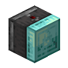

# Functional Blocks

## Advanced Hopper

`vc:advanced_hopper`
| Component | Value |
|---|---|
|Breaking time (secs)|20|
|Luminous|No|
|Blast resistance|_Not Set_|
|Flammable|No|
|Conducts Redstone|Yes|
|Waterloggable|Yes|
|Placement Style|Positional|

### About:

## Advanced Observer

`vc:advanced_observer`
| Component | Value |
|---|---|
|Breaking time (secs)|20|
|Luminous|No|
|Blast resistance|_Not Set_|
|Flammable|No|
|Conducts Redstone|Yes|
|Placement Style|Directional|

### About:

## Blazer

`vc:blazer`
| Component | Value |
|---|---|
|Breaking time (secs)|20|
|Luminous|No|
|Blast resistance|_Not Set_|
|Flammable|No|
|Conducts Redstone|Yes|
|Placement Style|Directional|

### About:

## Carnavorus Chorus Plant

`vc:chorus_carnavorus_plant`
| Component | Value |
|---|---|
|Breaking time (secs)|7|
|Luminous|No|
|Blast resistance|_Not Set_|
|Flammable|No|
|Conducts Redstone|No|

### About:

## Glass Door

`vc:glass_door`
| Component | Value |
|---|---|
|Breaking time (secs)|2.5|
|Luminous|No|
|Blast resistance|_Not Set_|
|Flammable|Yes (5)|
|Conducts Redstone|No|
|Placement Style|Directional|

### About:

## Glass Trapdoor

`vc:glass_trapdoor`
| Component | Value |
|---|---|
|Breaking time (secs)|3|
|Luminous|No|
|Blast resistance|_Not Set_|
|Flammable|Yes (5)|
|Conducts Redstone|No|
|Placement Style|Directional|

### About:

## Gunpowder Line

`vc:gunpowder_line`
| Component | Value |
|---|---|
|Breaking time (secs)|0.2|
|Luminous|No|
|Blast resistance|_Not Set_|
|Flammable|Yes (10)|
|Conducts Redstone|No|

### About:

## Knowlage Harvester

`vc:knowlage_harvester`
| Component | Value |
|---|---|
|Breaking time (secs)|5|
|Luminous|Yes (10)|
|Blast resistance|_Not Set_|
|Flammable|No|
|Conducts Redstone|No|
|Placement Style|Directional|

### About:

## Pumice

`vc:pumice`
| Component | Value |
|---|---|
|Breaking time (secs)|15|
|Luminous|No|
|Blast resistance|_Not Set_|
|Flammable|No|
|Conducts Redstone|No|

### About:

## Saturated Pumice

`vc:saturated_pumice`
| Component | Value |
|---|---|
|Breaking time (secs)|15|
|Luminous|No|
|Blast resistance|_Not Set_|
|Flammable|No|
|Conducts Redstone|No|

### About:

## Rotator

`vc:rotator`
| Component | Value |
|---|---|
|Breaking time (secs)|25|
|Luminous|No|
|Blast resistance|_Not Set_|
|Flammable|No|
|Conducts Redstone|Yes|

### About:

## Saturated Pumice

`vc:saturated_pumice`
| Component | Value |
|---|---|
|Breaking time (secs)|5|
|Luminous|No|
|Blast resistance|_Not Set_|
|Flammable|No|
|Conducts Redstone|No|

### About:

## Sawmill

`vc:sawmill`
| Component | Value |
|---|---|
|Breaking time (secs)|5|
|Luminous|No|
|Blast resistance|_Not Set_|
|Flammable|No|
|Conducts Redstone|No|

### About:
