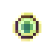
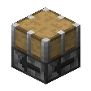

# Functional Blocks

## Advanced Hopper <Badge type="danger">[**Advanced System**](/advanced_system.html)</Badge>

`vc:advanced_hopper`
| Component | Value |
|---|---|
|Breaking time (secs)|20|
|Luminous|No|
|Blast resistance|_Not Set_|
|Flammable|No|
|Conducts Redstone|Yes|
|Waterloggable|Yes|
|Placement Style|Positional|

### About:
**Advanced Hoppers** are members of the Advanced family, they serve as an upgrade to the  [Hopper](https://minecraft.wiki/w/Hopper)
- They are much faster to their original counterpart. Their speed compares to a  [Hopper Minecart](https://minecraft.wiki/w/Minecart_with_Hopper)
- Unlike the original, they lack an openable UI.
- Their main feature is that they can be **Filtered**
    - Interacting with the Hopper once will inform the player of the current filter
    - Interacting with the Hopper twice will set the Hoppers filter to the held item
        - If the player is not holding an item, the filter will be cleared

    -  [Advanced Filters](/items/tools.html#advanced-filter) can also be used to create a more complex filter
        - To Learn more about this system, read [this page](/advanced_system.html)
        - Using an Advanced Filter will consume the item
            - If the Hopper's filter is later changed, the Advanced Filter will be returned.

            
### Crafting

    
 Advanced Hopper  

  

    

    
 Advanced Filter  

    
 

    
 Compressed Copper  

    
 Hopper  

    
 Compressed Copper  

    

    
 Redstone  

    
 

  

## Advanced Observer <Badge type="danger">[**Advanced System**](/advanced_system.html)</Badge>

`vc:advanced_observer`
| Component | Value |
|---|---|
|Breaking time (secs)|20|
|Luminous|No|
|Blast resistance|_Not Set_|
|Flammable|No|
|Conducts Redstone|Yes|
|Placement Style|Directional|

### About:

**Advanced Observers** are members of the Advanced family, they serve as an upgrade to the [Observer](https://minecraft.wiki/w/Observer)
- Rather than detecting block updates, they look for a specific block's presence
- Once detected, they take on a suprised expression </img>
- They choose how to detect blocks via **Filters**
    - Interacting with the Observer once will inform the player of the current filter
    - Interacting with the Observer twice will set the Observer's filter to the held item
        - Unlike Advanced Hoppers, Observers cannot lack a filter. Otherwise they just don't do anything.

    -  [Advanced Filters](/items/tools.html#advanced-filter) can also be used to create a more complex filter
        - To Learn more about this system, read ***[this page](/advanced_system.html)***
        - Using an Advanced Filter will consume the item
            - If the Observer's filter is later changed, the Advanced Filter will be returned.

### Crafting

    
 Advanced Observer  

  

    

    
 Advanced Filter  

    
 

    
 Gloricalium Sheet  

    
 Observer  

    
 Gloricalium Sheet  

  

## Breezer

`vc:breezer`
| Component | Value |
|---|---|
|Breaking time (secs)|20|
|Luminous|No|
|Blast resistance|_Not Set_|
|Flammable|No|
|Conducts Redstone|Yes|
|Placement Style|Directional|

### About:
**Breezers** when powered by redstone, will emmit wind gust that push entities
- The strength of the wind corrosponds to the redstone strength
- Entities with high knockback resistance, like the [Iron Golem](https://minecraft.wiki/w/Iron_Golem), cannot be moved by the breezer

</img>

### Crafting

    
 Breezer  

  

    
 Wind Charge  

    
 Gloricalium Grate  

    
 Wind Charge  

    
 Breeze Rod  

    
 Iron Ignot  

    
 Breeze Rod  

    
 Copper Ingot  

    
 Redstone  

    
 Copper Ingot  

  

## Blazer

`vc:blazer`
| Component | Value |
|---|---|
|Breaking time (secs)|20|
|Luminous|No|
|Blast resistance|_Not Set_|
|Flammable|No|
|Conducts Redstone|Yes|
|Placement Style|Directional|

### About:
**Blazers** when powered by redstone, will emmit fire that burns exclusively entities
- Blazers cannot set the ground on fire

### Crafting

    
 Blazer  

  

    
 Blazer Poweder  

    
 Gloricalium Grate  

    
 Blazer Poweder  

    
 Blaze Rod  

    
 Iron Ignot  

    
 Blaze Rod  

    
Nether Brick 

    
 Redstone  

    
Nether Brick 

  

## Carnavorus Chorus Plant

`vc:chorus_carnavorus_plant`
| Component | Value |
|---|---|
|Breaking time (secs)|7|
|Luminous|No|
|Blast resistance|_Not Set_|
|Flammable|No|
|Conducts Redstone|No|

### About:
**Carnavorus Chorus Plant** spawn as the source of odd growth in the End Waste
When approached by the player, stems will rapidly extend out of the center of the plant
- They can grow 2-5 blocks high
- If they grow 3+ blocks high, it will attempt to attack the player by emmiting sickening pollen
  - This pollen will give the player  Weakness,  Slowness, and  Nausea.

- Around the chorus growth,  **Rooted End Stone** will appear.
  - When stepped on, small chompers will nibble at your feet, dealing 1-2 of damage

  

- The plant was inspired by this plant by Minecraft Dungeons, and the plants from  [a book i read a while ago](https://www.goodreads.com/book/show/50215833-bloom)

## Gunpowder Line

`vc:gunpowder_line`
| Component | Value |
|---|---|
|Breaking time (secs)|0.2|
|Luminous|No|
|Blast resistance|_Not Set_|
|Flammable|Yes (10)|
|Conducts Redstone|No|

### About:
 **Gunpowder** now should be placeable on the ground.
- When lit with a  **Flint and Steel** the gunpowder will begin to burst in a slow chain, igniting any Gunpowder and  **TNT** in it's path.

## Knowlage Harvester

`vc:knowlage_harvester`
| Component | Value |
|---|---|
|Breaking time (secs)|5|
|Luminous|Yes (10)|
|Blast resistance|_Not Set_|
|Flammable|No|
|Conducts Redstone|No|
|Placement Style|Directional|

### About:
**Knowlage Harvesters** are used to store and manage  **Experience** and  **Crystalized Experience**
- Crystalized Experience can be obtained from [**Frozen Feathers**](/items/tools.html#frozen-feather)
- So far, there are 2 main functions of the Knowlage Harvester:
  1. Crystalized Experience can be harvested back into actual Expeirence
  2. Paper can be used to store levels of xp onto  [**Scrolls**](/items/tools.html#scroll)

### Crafting

    
 Knowladge Harvester  

  

    

    
 Book   

    

    
 Amethyst Shard  

    
 Obsidian  

    
 Amethyst Shard  

    
 Obsidian  

    
 Cystalized Experience Block  

    
 Obsidian  

  

## Pumice

`vc:pumice`
| Component | Value |
|---|---|
|Breaking time (secs)|15|
|Luminous|No|
|Blast resistance|_Not Set_|
|Flammable|No|
|Conducts Redstone|No|

### About:
**Pumice** serves as a Lava alternative for a  [**Sponge**](https://minecraft.wiki/w/Sponge)
- If it asorbs any lava, it will turn into  [**Saturated Pumice**](/blocks/functional.html#saturated-pumice)

## Saturated Pumice

`vc:saturated_pumice`
| Component | Value |
|---|---|
|Breaking time (secs)|15|
|Luminous|No|
|Blast resistance|_Not Set_|
|Flammable|No|
|Conducts Redstone|No|

### About:
**Saturated Pumice** serves as a Lava alternative for a  [**Wet Sponge**](https://minecraft.wiki/w/Sponge)
- When interacted with a  **Bucket**, the lava will be extracted, and it will return to [Normal](/blocks/functional.html#pumice)

## Rotator

`vc:rotator`
| Component | Value |
|---|---|
|Breaking time (secs)|25|
|Luminous|No|
|Blast resistance|_Not Set_|
|Flammable|No|
|Conducts Redstone|Yes|

### About:
**Roators** are a block that have the unique ability to rotate structures in 90 degree intervals
- When powered with redstone, the Rotator will rotate the block above it *Clockwise* or *Counterclockwise*
    - You can configure it's direction by interacting with the Rotator
- [Slime Block](https://minecraft.wiki/w/Slime_Block) structures on top of the rotator will spin all the blocks connected to it
- The Rotator can spin up to 24 blocks
- If a block is in the way of rotation the rotated block will break.
- Blocks that cannot be moved by pistons cannot be rotated

### Crafting

    
 Rotator  

  

    
 Any Planks   

    
 Any Planks   

    
 Any Planks   

    
 Cobblestone  

    
 Copper Wrench  

    
 Cobblestone  

    
 Cobblestone  

    
 Redstone  

    
 Cobblestone  

  

## Sawmill

`vc:sawmill`
| Component | Value |
|---|---|
|Breaking time (secs)|5|
|Luminous|No|
|Blast resistance|_Not Set_|
|Flammable|No|
|Conducts Redstone|No|

### About:
The **Sawmill** is a Wood variant to the  [**Stonecutter**](https://minecraft.wiki/w/Stonecutter)
- Placing a  [**Plank**](https://minecraft.wiki/w/Planks) into it's corresponding slot, will convert it into that shape.
- Custom planks do not have a sign variant
- I actually did the math on all of these, relative to the model pixels, on how many of each item you should get.

### Crafting

    
 Sawmill  

  

    

    
 Iron Ignot  

    

    
 Any Planks   

    
 Any Planks   

    
 Any Planks   

    
 Stick  

    
 

    
 Stick  

  

