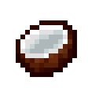

# Plants

## Bubble Flower

`vc:bubble_flower`
| Component | Value |
|---|---|
|Breaking time (secs)|0.2|
|Luminous|Yes (3)|
|Blast resistance|_Not Set_|
|Flammable|No|
|Conducts Redstone|No|

### About:
**Bubble Flower**s are a direct reference to the **Goodlands** found in the [Eerie Mojang Office Party](https://minecraft.wiki/w/Eerie_Mojang_Office_Party), recreating the flowers that spawn bubbles.
- Obviously, they can be found in the small [Goodlands](/features.html#goodlands) patch found in the Badlands.

## Cattail

`vc:cattail`
|Component|Value|
|---|---|
|Breaking time (secs)|0.1|
|Luminous|No|
|Blast resistance|_Not Set_|
|Flammable|Yes (30)|
|Conducts Redstone|No|
|Waterloggabe|Yes|

### About
**Cattail**s are a new plant that can be found in rivers or beaches.
- They lack much other purpose

## Coconut

`vc:coconut`
|Component|Value|
|---|---|
|Breaking time (secs)|2|
|Luminous|No|
|Blast resistance|0|
|Flammable|Yes (5)|
|Conducts Redstone|No|
|Waterloggabe|No|
|Placement Style: |Positional|

### About
**Coconuts** are a new plant/food that spawns on [Palm Trees](/featues.html#palm-tree)
- When mined, they will fall to the ground (Unless silk touch is used)
- When they fall, they will split into Two  [Coconut Slices](/items/food.html#coconut-slice)

## Green Pedals

`vc:green_pedals`
| Component | Value |
|---|---|
|Breaking time (secs)|0.2|
|Luminous|No|
|Blast resistance|_Not Set_|
|Flammable|No|
|Conducts Redstone|No|

### About:
**Green Pedals**s are a direct reference to the **Goodlands** found in the [Eerie Mojang Office Party](https://minecraft.wiki/w/Eerie_Mojang_Office_Party), recreating the flowers that spawn bubbles.
- Obviously, they can be found in the small [Goodlands](/features.html#goodlands) patch found in the Badlands.
- They function similarly to [Pink Petals](https://minecraft.wiki/w/Pink_Pedals), however they lack the ability to be stacked

## Lavender

`vc:lavender`
| Component | Value |
|---|---|
|Breaking time (secs)|0.1|
|Luminous|No|
|Blast resistance|_Not Set_|
|Flammable|Yes (30)|
|Conducts Redstone|No|

### About:
**Lavender** plants are a direct reference to the **Goodlands** found in the [Eerie Mojang Office Party](https://minecraft.wiki/w/Eerie_Mojang_Office_Party), recreating the flowers that spawn bubbles.
- Obviously, they can be found in the small [Goodlands](/features.html#goodlands) patch found in the Badlands.

## Glistering Melon

`vc:melon_speckled`
| Component | Value |
|---|---|
|Breaking time (secs)|1.5|
|Luminous|No|
|Blast resistance|_Not Set_|
|Flammable|No|
|Conducts Redstone|No|

### About:
**Glistering Melon**s are a Full Block variant to  [Glistering Melon Slice](https://minecraft.wiki/w/Glistering_Melon_Slice)

### Crafting:

    
 Glistering Melon  

  

    
 Glistering Melon Slice  

    
 Glistering Melon Slice  

    
 Glistering Melon Slice  

    
 Glistering Melon Slice  

    
 Glistering Melon Slice  

    
 Glistering Melon Slice  

    
 Glistering Melon Slice  

    
 Glistering Melon Slice  

    
 Glistering Melon Slice  

  

    
 Glistering Melon  

  

    
 Gold Ingot  

    
 Gold Ingot  

    
 Gold Ingot  

    
 Gold Ingot  

    
 Melon  

    
 Gold Ingot  

    
 Gold Ingot  

    
 Gold Ingot  

    
 Gold Ingot  

  

## Orchid Cactus Flower

`vc:orchid_cactus_flower`
|Component|Value|
|---|---|
|Breaking time (secs)|0.5|
|Luminous|No|
|Blast resistance|*Not Set*|
|Flammable|No|
|Conducts Redstone|No|
|Waterloggabe|No|

### About
**Orchid Cactus Flowers** are a variant of [Cactus Flower](https://minecraft.wiki/w/Cactus_Flower)
- Because of their large shape, they neglect damage on the top of a cactus
  - As a side effect, it's hitbox is twice as high as it normally would be
- Orchid Cactus flowers were originally called Cactus Flower's (or Flowering Cactus) until [the vanilla One](https://minecraft.wiki/w/Cactus_Flower) was added.

## Waterlily with Lotus

`vc:waterlily_lotus`
| Component | Value |
|---|---|
|Breaking time (secs)|0.5|
|Luminous|No|
|Blast resistance|_Not Set_|
|Flammable|No|
|Conducts Redstone|No|
|Placement Style|Directional|

### About:
**Waterlily with Lotus**s are a rare  [Waterlily](https://minecraft.wiki/w/Waterlily) variant with a flower on top!
- thats kinda it
 

---

# Misc Blocks

## Charcoal Block

`vc:charcoal_block`
|Component|Value|
|---|---|
|Breaking time (secs)|5|
|Luminous|No|
|Blast resistance|6|
|Flammable|Yes (5)|
|Conducts Redstone|No|
|Waterloggabe|No|

### About
**Charcoal Blocks**s are simply a full block of [**Charcoal**](https://minecraft.wiki/w/Charcoal)

### Crafting:

    
 Charcoal Block  

  

    
 Charcoal  

    
 Charcoal  

    
 Charcoal  

    
 Charcoal  

    
 Charcoal  

    
 Charcoal  

    
 Charcoal  

    
 Charcoal  

    
 Charcoal  

  

## Crystalized Experience Block

`vc:crystalized_experience_block`
| Component | Value |
|---|---|
|Breaking time (secs)|1.1|
|Luminous|Yes (13)|
|Blast resistance|0|
|Flammable|No|
|Conducts Redstone|No|

### About:
**Crystalized Experience Blocks**s are simply a full block of  [**Crystalized Experience**](/items/misc.html#crystalized-experience)

### Crafting:

    
 Crystalized Experience Block  

  

    
 Crystalized Experience  

    
 Crystalized Experience  

    
 Crystalized Experience  

    
 Crystalized Experience  

    
 Crystalized Experience  

    
 Crystalized Experience  

    
 Crystalized Experience  

    
 Crystalized Experience  

    
 Crystalized Experience  

  

## Endslate

`vc:endslate`
| Component | Value |
|---|---|
|Breaking time (secs)|20|
|Luminous|No|
|Blast resistance|9|
|Flammable|No|
|Conducts Redstone|No|

### About:
**Endslate** is [The Ends](https://minecraft.wiki/w/The_End) variant of  [**Deepslate**](https://minecraft.wiki/w/Deepslate)
- It replaces all End stone below $y=32$

## Spew

`vc:spew`
| Component | Value |
|---|---|
|Breaking time (secs)|5|
|Luminous|Yes (15)|
|Blast resistance|5|
|Flammable|No|
|Conducts Redstone|No|

### About:
**Spews** are found in [Nether Springs](/features.html#nether-springs)
- They emmit smoke and occasionally spew lava over the water.

