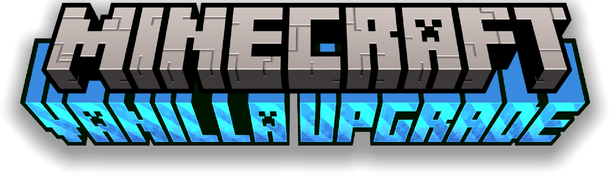
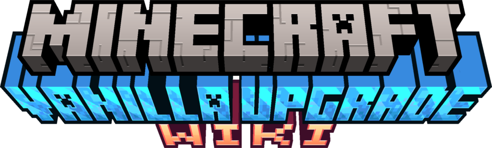

# Contributions
## Vanilla Upgrade Contributers

### Project Lead
-  [**Vlliage**](https://www.youtube.com/channel/UChwQtSs393MhXY5OFIDQXew): Director, Lead Programmer, Artist, Sound Design, Editor, Marketing, and everything inbetween
-  [**_RealmEcko**](https://www.youtube.com/channel/UCRgaUgIwo4c5f_zaJKWaFWw): Lead Artist, discord management, designer
-  **j.gu12?**: Artist
-  **"Pillagecool"**: Created Sparse Model, and some other things idr

 

-  [**Clorate 21**](https://www.youtube.com/@Cloro21) composed Subhour.
-  [**For_Builds**](https://www.youtube.com/watch?v=CjOO9qrDg3c&t=1s&ab_channel=for%28inactiveacc%29) composed Mist.

### Other Contribution
-  [**Mojang**](https://en.wikipedia.org/wiki/Mojang_Studios) Created the amazing game this was built off of
-  [**learn.microsoft.com**](https://learn.microsoft.com/en-us/minecraft/creator/scriptapi/minecraft/server/minecraft-server?view=minecraft-bedrock-stable) Only reason I was able to learn script
-  [**Sunrise Studios**](https://api.sunrise-studio.site/translator/ts.html) created the translator used to translate Vanilla Upgrade into other languages.
-  [**Origin Realms**](https://originrealms.com/) "Inspiration" for v1 😅
-  [**Ramcor14_Player**](https://mcpedl.com/user/ramcor14-br/): I think they wrote the "setPermutaion" function idr
-  [**Actions & Stuff**](https://www.minecraft.net/en-us/marketplace/pdp?id=61c7a786-d7ad-49e0-a710-817121cd9795) Animation Pack used in the release trailer
-  [**Ewan Howell**](https://ewanhowell.com/plugins/minecraft-title-generator/) Created the BlockBench extention used to create the logo
-  **The Communtiy**: Gave inspiration and feedback!
-  [**You**](https://www.merriam-webster.com/dictionary/you) for taking interest!

## Vanilla Upgrade Wiki Contributers

-  [**Vlliage**](https://www.youtube.com/channel/UChwQtSs393MhXY5OFIDQXew), providing assets, writing, development, basically everything
-  [**ChatGPT 4.0 mini**](https://chatgpt.com), assisted with tab switchers and Minecraft UI layouts
-  **[Minecraft Wiki](https://minecraft.wiki/)**, provided vanilla assets/renders

