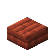
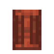
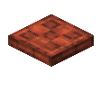
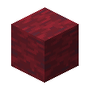

# Features

## Azalea

  <label class="radioswitcher">
    <input type="radio" name="radioswitcher" v-model="selectedInfo" value="option1">
    

Block
  </label>
  <label class="radioswitcher">
    <input type="radio" name="radioswitcher" v-model="selectedInfo" value="option2">
        

Stairs
  </label>
  <label class="radioswitcher">
    <input type="radio" name="radioswitcher" v-model="selectedInfo" value="option3">
        

Slab
  </label>
  <label class="radioswitcher">
    <input type="radio" name="radioswitcher" v-model="selectedInfo" value="option4">
        

Door
  </label>
  <label class="radioswitcher">
    <input type="radio" name="radioswitcher" v-model="selectedInfo" value="option45">
        

Trapdoor
  </label>
  <label class="radioswitcher">
    <input type="radio" name="radioswitcher" v-model="selectedInfo" value="option5">
        

Fence
  </label>
  <label class="radioswitcher">
    <input type="radio" name="radioswitcher" v-model="selectedInfo" value="option6">
        

Fence Gate
  </label>
  <label class="radioswitcher">
    <input type="radio" name="radioswitcher" v-model="selectedInfo" value="option7">
        

Log
  </label>
  <label class="radioswitcher">
    <input type="radio" name="radioswitcher" v-model="selectedInfo" value="option8">
        

Wood
  </label>
  <label class="radioswitcher">
    <input type="radio" name="radioswitcher" v-model="selectedInfo" value="option9">
        

Stripeped Log
  </label>
  <label class="radioswitcher">
    <input type="radio" name="radioswitcher" v-model="selectedInfo" value="option10">
        

Stripped Wood
  </label>

<button @click="isOpen = !isOpen">
  {{ isOpen ? "Read More" : "Read Less" }}
</button>
<!-- Transition Wrapper for Collapsible Info Box -->
<transition name="slide">
  

</transition>

Yummy

