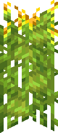

# Crops
::: warning Incomplete Article
This article is incomplete! So it may lack details or crucial information.
:::

## Aloe Plant

`vc:aloe_plant`
| Component | Value |
|---|---|
|Breaking time (secs)|0.01|
|Luminous|No|
|Blast resistance|_Not Set_|
|Flammable|No|
|Conducts Redstone|No|

### About:

## Corn Kernels

`vc:corn_kernels` `vc:corn_wild`
| Component | Value |
|---|---|
|Stackable|Yes (64)   Unobtainable (Wild)|
|Breaking time (secs)|0.1|
|Luminous|No|
|Flammable|No|

### About:

## Cotton Seeds

`vc:cotton_seeds`
| Component | Value |
|---|---|
|Stackable|Yes (64)|
|Breaking time (secs)|0.1|
|Luminous|No|
|Flammable|No|

### About:

## Tomato Seeds

`vc:tomato_seeds`
| Component | Value |
|---|---|
|Stackable|Yes (64)|
|Breaking time (secs)|0.1|
|Luminous|No|
|Flammable|No|

### About:

## Warped Wart

`vc:warped_wart`
| Component | Value |
|---|---|
|Stackable|Yes (64)|
|Breaking time (secs)|0.5|
|Luminous|No|
|Flammable|No|
|Enchantable|No|
|Deals Damage|No|

### About:

