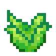

# Crops

## Aloe Plant

`vc:aloe_plant`
| Component | Value |
|---|---|
|Breaking time (secs)|0.01|
|Luminous|No|
|Blast resistance|_Not Set_|
|Flammable|No|
|Conducts Redstone|No|

### About:

## Corn Kernels

`vc:corn_kernels`
| Component | Value |
|---|---|
|Stackable|Yes (64)|
|Breaking time (secs)|0.1|
|Luminous|No|
|Flammable|No|

### About:

## Wild Corn

`vc:corn_wild`
| Component | Value |
|---|---|
|Stackable|Unobtainable|
|Breaking time (secs)|0.1|
|Luminous|No|
|Flammable|No|

### About:

## Cotton Seeds

`vc:cotton_seeds`
| Component | Value |
|---|---|
|Stackable|Yes (64)|
|Breaking time (secs)|0.1|
|Luminous|No|
|Flammable|No|

### About:

## Tomato Seeds

`vc:tomato_seeds`
| Component | Value |
|---|---|
|Stackable|Yes (64)|
|Breaking time (secs)|0.1|
|Luminous|No|
|Flammable|No|

### About:
