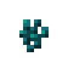

# Crops
::: warning Incomplete Article
This article is incomplete! So it may lack details or crucial information.
:::

## Aloe Plant

`vc:aloe_plant`
| Component | Value |
|---|---|
|Breaking time (secs)|0.01|
|Luminous|No|
|Blast resistance|_Not Set_|
|Flammable|No|
|Conducts Redstone|No|
|Drops|

### About:
**Aloe Plants** spawn in [Nether Springs](/features.html#nether-springs) on certan rocks

## Corn Kernels

`vc:corn_kernels` `vc:corn_wild`
| Component | Value |
|---|---|
|Stackable|Yes (64)   Unobtainable (Wild)|
|Breaking time (secs)|0.1|
|Luminous|No|
|Flammable|No|
|Drops|

### About:
**Corn Plants** are found in wild patches in the plains biome.

## Cotton Seeds

`vc:cotton_seeds`
| Component | Value |
|---|---|
|Stackable|Yes (64)|
|Breaking time (secs)|0.1|
|Luminous|No|
|Flammable|No|
|Drops|

### About:
**Cotton** is a slightly unused crop that typically is not found anywhere in the wild
- it might spawn in chest idr
- can be a way to grow leather, when crafted with honeycomb

## Tomato Seeds

`vc:tomato_seeds`
| Component | Value |
|---|---|
|Stackable|Yes (64)|
|Breaking time (secs)|0.1|
|Luminous|No|
|Flammable|No|
|Drops|

### About:
**Tomatoes** can be found in jungle villages, and in certan chests.

## Warped Wart

`vc:warped_wart`
| Component | Value |
|---|---|
|Stackable|Yes (64)|
|Breaking time (secs)|0.5|
|Luminous|No|
|Flammable|No|
|Enchantable|No|
|Deals Damage|No|
|Drops|

### About:
- Warped wart is found in nether fortesses in the warped forest biome
- Warped wart can be made into [Blue Nether Bricks](/blocks/deco.html#blue-nether-bricks)

### Crafting:

    
 Warped Wart Block  

  

    
 Warped Wart  

    
 Warped Wart  

    
 Warped Wart  

    
 Warped Wart  

    
 Warped Wart  

    
 Warped Wart  

    
 Warped Wart  

    
 Warped Wart  

    
 Warped Wart  

  

    
 Warped Wart   

  

    
 Warped Wart Block  

    
 Warped Wart Block  

    
 Warped Wart Block  

    
 Warped Wart Block  

    
 Nether Wart  

    
 Warped Wart Block  

    
 Warped Wart Block  

    
 Warped Wart Block  

    
 Warped Wart Block  

  

    
 Nether Wart   

  

    
 Nether Wart Block  

    
 Nether Wart Block  

    
 Nether Wart Block  

    
 Nether Wart Block  

    
 Warped Wart  

    
 Nether Wart Block  

    
 Nether Wart Block  

    
 Nether Wart Block  

    
 Nether Wart Block  

  

