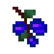
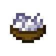
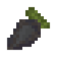
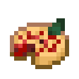

# Food Items
::: warning Incomplete Article
This article is incomplete! So it may lack details or crucial information.
:::

## Aloe Vera

`vc:aloe_vera`
| Component | Value |
|---|---|
|Stackable|Yes (64)|
|Use Duration|0.3|
|Nutrition|1 |
|Saturation|3|

### About: 

## Aloe Vera Golden

`vc:aloe_vera_golden`
| Component | Value |
|---|---|
|Stackable|Yes (64)|
|Use Duration|0.3|
|Nutrition|1 |
|Saturation|3|

### About: 

## Bat Wing

`vc:bat_wing`
| Component | Value |
|---|---|
|Stackable|Yes (64)|
|Use Duration|1.61|
|Nutrition|4 |
|Saturation|3|

### About: 

## Cooked Bat Wing

`vc:bat_wing_cooked`
| Component | Value |
|---|---|
|Stackable|Yes (64)|
|Use Duration|1.61|
|Nutrition|8 |
|Saturation|10|

### About: 

### Smelting

    
 Cooked Bat Wing  

    
 Bat Wingk  

    
 Any Fuel  

## Blue Berries

`vc:blue_berries`
| Component | Value |
|---|---|
|Stackable|Yes (64)|
|Breaking time (secs)|0.5|
|Luminous|No|
|Flammable|No|
|Deals Damage|No|
|Use Duration|1.61|
|Nutrition|2 |
|Saturation|5|

### About: 

## Bone Meal Meal

`vc:bone_meal_meal`
| Component | Value |
|---|---|
|Stackable|No|
|Use Duration|2.31|
|Nutrition|6 |
|Saturation|6|

### About: 

## Bragoneese

`vc:bragoneese`
| Component | Value |
|---|---|
|Stackable|Yes (64)|
|Use Duration|1.61|
|Nutrition|1 |
|Saturation|10|

### About: 

## Charhood

`vc:charhood`
| Component | Value |
|---|---|
|Stackable|Yes (64)|
|Use Duration|1.61|
|Nutrition|4 |
|Saturation|3|

### About: 

## Chocolate Cake

`vc:chocolate_cake`
<Badge type="warning" text="Stats are Per Bite"/>
| Component | Value |
|---|---|
|Stackable|No|
|Nutrition|2 |
|Saturation|2.8|

### About: 

### Crafting

    
 Chocolate Cake  

  

    
 Bucket of Chocolate Milk  

    
 Bucket of Chocolate Milk  

    
 Bucket of Chocolate Milk  

    
 Sugar  

    
 Egg  

    
 Sugar  

    
 Wheat  

    
 Wheat  

    
 Wheat  

  

## Chocolate Milk Bucket

`vc:chocolate_milk_bucket`
| Component | Value |
|---|---|
|Stackable|No|
|Use Duration|1.61|
|Nutrition|6 |
|Saturation|2|

### About: 

## Cocojuice

`vc:cocojuice`
| Component | Value |
|---|---|
|Stackable|No|
|Use Duration|1.61|
|Nutrition|4 |
|Saturation|5|

### About: 

## Coconut Husk

`vc:coconut_husk`
| Component | Value |
|---|---|
|Stackable|Yes (64)|

### About: 

### Crafting

    
 Coconut  

  

    
 

    
 

    
 

    
 Coconut Husk  

    
 Milk Bucket  

    
 Coconut Husk  

    
 

    
 

    
 

  

## Coconut Slice

`vc:coconut_slice`
| Component | Value |
|---|---|
|Stackable|Yes (64)|
|Use Duration|2.31|
|Nutrition|3 |
|Saturation|3.5|

### About: 

### Crafting

    
 Coconut  

  

    
 Coconut Slice  

    
 Coconut Slice  

    
 

    
 

    
 

    
 

    
 

    
 

    
 

  

## Corn

`vc:corn`
| Component | Value |
|---|---|
|Stackable|Yes (64)|
|Use Duration|2.31|
|Nutrition|6 |
|Saturation|2|

### About: 

## Cornbread

`vc:cornbread`
| Component | Value |
|---|---|
|Stackable|Yes (64)|
|Use Duration|1.61|
|Nutrition|5 |
|Saturation|6|

### About: 

## Bucket of Hot Chocolate

`vc:hot_chocolate_bucket`
| Component | Value |
|---|---|
|Stackable|No|
|Use Duration|1.81|
|Nutrition|6 |
|Saturation|5|

### About: 

### Smelting

    
 Bucket of Hot Chocolate  

    
 Bucket of Chocolate Milk  

    
 Any Fuel  

## Maganset

`vc:maganset`
| Component | Value |
|---|---|
|Stackable|Yes (64)|
|Use Duration|1.61|
|Nutrition|3 |
|Saturation|4|

### About: 

## Mudfruit

`vc:mudfruit`
| Component | Value |
|---|---|
|Stackable|Yes (64)|
|Use Duration|1.61|
|Nutrition|6 |
|Saturation|6|

### About: 

## Popcorn

`vc:popcorn`
| Component | Value |
|---|---|
|Stackable|Yes (64)|
|Use Duration|1.61|
|Nutrition|3 |
|Saturation|5|

### About: 

## Sea Pineapple

`vc:sea_pineapple`
| Component | Value |
|---|---|
|Stackable|Yes (64)|
|Use Duration|1.71|
|Nutrition|6 |
|Saturation|15|

### About: 

## Spaticius

`vc:spaticius`
| Component | Value |
|---|---|
|Stackable|No|
|Use Duration|1.61|
|Nutrition|2 |
|Saturation|1|

### About: 

## Sweet Berry Pie

`vc:sweet_berry_pie`
| Component | Value |
|---|---|
|Stackable|No|
|Use Duration|1.61|
|Nutrition|8 |
|Saturation|5|

### About: 

## Tomato

`vc:tomato`
| Component | Value |
|---|---|
|Stackable|Yes (64)|
|Use Duration|1.61|
|Nutrition|4 |
|Saturation|5|

### About: 
