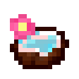
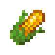

# Food Items

## Aloe Vera

`vc:aloe_vera`
| Component | Value |
|---|---|
|Stackable|Yes (64)|
|Enchantable|No|
|Deals Damage|No|
|Use Duration|0.3|
|Nutrition|1|
|Saturation|3|

### About: 

## Aloe Vera Golden

`vc:aloe_vera_golden`
| Component | Value |
|---|---|
|Stackable|Yes (64)|
|Enchantable|No|
|Deals Damage|No|
|Use Duration|0.3|
|Nutrition|1|
|Saturation|3|

### About: 

## Bat Wing

`vc:bat_wing`
| Component | Value |
|---|---|
|Stackable|Yes (64)|
|Enchantable|No|
|Deals Damage|No|
|Use Duration|1.61|
|Nutrition|4|
|Saturation|3|

### About: 

## Bat Wing Cooked

`vc:bat_wing_cooked`
| Component | Value |
|---|---|
|Stackable|Yes (64)|
|Enchantable|No|
|Deals Damage|No|
|Use Duration|1.61|
|Nutrition|8|
|Saturation|10|

### About: 

## Blue Berries

`vc:blue_berries`
| Component | Value |
|---|---|
|Stackable|Yes (64)|
|Breaking time (secs)|0.5|
|Luminous|No|
|Flammable|No|
|Deals Damage|No|
|Use Duration|1.61|
|Nutrition|2|
|Saturation|5|

### About: 

## Bone Meal Meal

`vc:bone_meal_meal`
| Component | Value |
|---|---|
|Stackable|No|
|Enchantable|No|
|Deals Damage|No|
|Use Duration|2.31|
|Nutrition|6|
|Saturation|6|

### About: 

## Bragoneese

`vc:bragoneese`
| Component | Value |
|---|---|
|Stackable|No|
|Enchantable|No|
|Deals Damage|No|
|Use Duration|1.61|
|Nutrition|1|
|Saturation|10|

### About: 

## Charhood

`vc:charhood`
| Component | Value |
|---|---|
|Stackable|No|
|Enchantable|No|
|Deals Damage|No|
|Use Duration|1.61|
|Nutrition|4|
|Saturation|3|

### About: 

## Chocolate Cake

`vc:chocolate_cake`
| Component | Value |
|---|---|
|Stackable|No|
|Enchantable|No|
|Deals Damage|No|

### About: 

## Chocolate Milk Bucket

`vc:chocolate_milk_bucket`
| Component | Value |
|---|---|
|Stackable|No|
|Enchantable|No|
|Deals Damage|No|
|Use Duration|1.61|
|Nutrition|6|
|Saturation|2|

### About: 

## Cocojuice

`vc:cocojuice`
| Component | Value |
|---|---|
|Stackable|No|
|Enchantable|No|
|Deals Damage|No|
|Use Duration|1.61|
|Nutrition|4|
|Saturation|5|

### About: 

## Coconut Husk

`vc:coconut_husk`
| Component | Value |
|---|---|
|Stackable|Yes (64)|
|Enchantable|No|
|Deals Damage|No|

### About: 

## Coconut Slice

`vc:coconut_slice`
| Component | Value |
|---|---|
|Stackable|Yes (64)|
|Enchantable|No|
|Deals Damage|No|
|Use Duration|2.31|
|Nutrition|3|
|Saturation|3.5|

### About: 

## Corn

`vc:corn`
| Component | Value |
|---|---|
|Stackable|Yes (64)|
|Enchantable|No|
|Deals Damage|No|
|Use Duration|2.31|
|Nutrition|6|
|Saturation|2|

### About: 

## Cornbread

`vc:cornbread`
| Component | Value |
|---|---|
|Stackable|Yes (64)|
|Enchantable|No|
|Deals Damage|No|
|Use Duration|1.61|
|Nutrition|5|
|Saturation|6|

### About: 

## Bucket of Hot Chocolate

`vc:hot_chocolate_bucket`
| Component | Value |
|---|---|
|Stackable|No|
|Enchantable|No|
|Deals Damage|No|
|Use Duration|1.81|
|Nutrition|6|
|Saturation|5|

### About: 

## Maganset

`vc:maganset`
| Component | Value |
|---|---|
|Stackable|No|
|Enchantable|No|
|Deals Damage|No|
|Use Duration|1.61|
|Nutrition|3|
|Saturation|4|

### About: 

## Mudfruit

`vc:mudfruit`
| Component | Value |
|---|---|
|Stackable|No|
|Enchantable|No|
|Deals Damage|No|
|Use Duration|1.61|
|Nutrition|6|
|Saturation|6|

### About: 

## Popcorn

`vc:popcorn`
| Component | Value |
|---|---|
|Stackable|Yes (64)|
|Enchantable|No|
|Deals Damage|No|
|Use Duration|1.61|
|Nutrition|3|
|Saturation|5|

### About: 

## Sea Pineapple

`vc:sea_pineapple`
| Component | Value |
|---|---|
|Stackable|Yes (64)|
|Enchantable|No|
|Deals Damage|No|
|Use Duration|1.71|
|Nutrition|6|
|Saturation|15|

### About: 

## Spaticius

`vc:spaticius`
| Component | Value |
|---|---|
|Stackable|No|
|Enchantable|No|
|Deals Damage|No|
|Use Duration|1.61|
|Nutrition|2|
|Saturation|1|

### About: 

## Sweet Berry Pie

`vc:sweet_berry_pie`
| Component | Value |
|---|---|
|Stackable|No|
|Enchantable|No|
|Deals Damage|No|
|Use Duration|1.61|
|Nutrition|8|
|Saturation|5|

### About: 

## Tomato

`vc:tomato`
| Component | Value |
|---|---|
|Stackable|Yes (64)|
|Enchantable|No|
|Deals Damage|No|
|Use Duration|1.61|
|Nutrition|4|
|Saturation|5|

### About: 
