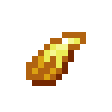
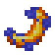
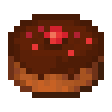
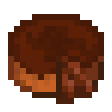
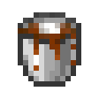
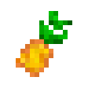
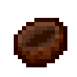
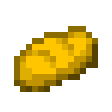

# Food Items
::: warning Incomplete Article
This article is incomplete! So it may lack details or crucial information.
:::

## Aloe Vera

`vc:aloe_vera`
| Component | Value |
|---|---|
|Stackable|Yes (64)|
|Use Duration|0.3|
|Nutrition|1 |
|Saturation|3|

### About: 

**Aloe Vera** is plant that comes from [The Nether](https://minecraft.wiki/w/The_Nether)
- Consuming a stalk will grant  [**Fire Resistance**](https://minecraft.wiki/w/Fire_Resistance) for 1 Second
- It is also very quick to eat, so idealy you can burn through a stack of these to get out of a situation like **Lava**
- This is a refrence to how *Real Life* aloe plants reduce pain from burns.

## Golden Aloe Vera

`vc:aloe_vera_golden`
| Component | Value |
|---|---|
|Stackable|Yes (64)|
|Use Duration|0.3|
|Nutrition|1 |
|Saturation|3|

### About: 
**Golden Aloe Vera** is a Golden variant of  **Aloe Vera**
- Consuming a stalk will grant  [**Resistance**](https://minecraft.wiki/w/Resistance) for 1 Second
- This serves as an upgrade to normal Aloe Vera by protecting you from everything instead of just fire.

### Crafting:

    
 Golden Aloe Vera  

  

    
 Gold Nugget  

    
 Gold Nugget  

    
 Gold Nugget  

    
 Gold Nugget  

    
 Aloe Vera  

    
 Gold Nugget  

    
 Gold Nugget  

    
 Gold Nugget  

    
 Gold Nugget  

  

## Bat Wing

`vc:bat_wing`
| Component | Value |
|---|---|
|Stackable|Yes (64)|
|Use Duration|1.61|
|Nutrition|4 |
|Saturation|3|

### About: 
**Bat Wings** are a simple new drop that comes from [Bats](https://minecraft.wiki/w/Bat)
- The texture is ripped from the Old bat texture
- as an old easter egg, bats would give the player a fake status effect  **Covid**
  - This has been removed

## Cooked Bat Wing

`vc:bat_wing_cooked`
| Component | Value |
|---|---|
|Stackable|Yes (64)|
|Use Duration|1.61|
|Nutrition|8 |
|Saturation|10|

### About: 
**Cooked Bat Wing** are the cooked variant of **Bat Wings**

### Smelting

    
 Cooked Bat Wing  

    
 Bat Wingk  

    
 Any Fuel  

## Blue Berries

`vc:blue_berries`
| Component | Value |
|---|---|
|Stackable|Yes (64)|
|Breaking time (secs)|0.5|
|Luminous|No|
|Flammable|No|
|Deals Damage|No|
|Use Duration|1.61|
|Nutrition|2 |
|Saturation|5|

### About: 
**Blue Berries** function very similarly to  [Sweet Berries](https://minecraft.wiki/w/Sweet_Berries)
- They spawn in [Plains](https://minecraft.wiki/w/Plains) Biomes
- They dont pluck the player or negate fall damage, unlike sweet berries
- They can be interacted with to harvest (unless using  Bone meal)

## Bone *Meal*

`vc:bone_meal_meal`
| Component | Value |
|---|---|
|Stackable|No|
|Use Duration|2.31|
|Nutrition|6 |
|Saturation|6|

### About: 
**Bone *Meal*** is a really [stupid](https://en.wikipedia.org/wiki/%22Yo_mama%22_joke) joke
- it is also one of the oldest textures in the addon

### Crafting:

    
 Bone <i>Meal</i>  

  

    

    
 Bone Meal  

    

    

    
 Bowl  

  

## Bragoneese

`vc:bragoneese`
| Component | Value |
|---|---|
|Stackable|Yes (64)|
|Use Duration|1.61|
|Nutrition|1 |
|Saturation|10|

### About: 
The **Bragoneese** is one of the 5 fruits of the  [Sparse](/mobs.html#sparse)'s labor
- It can be brewed into  [***Spiked* Cocojuice**](/items/food.html#cocojuice) using the Sparse

## Charhood

`vc:charhood`
| Component | Value |
|---|---|
|Stackable|Yes (64)|
|Use Duration|1.61|
|Nutrition|4 |
|Saturation|3|

### About: 
The **Charhood** is one of the 5 fruits of the  [Sparse](/mobs.html#sparse)'s labor
- It can be brewed into  [***Spiked* Cocojuice**](/items/food.html#cocojuice) using the Sparse

## Chocolate Cake

`vc:chocolate_cake`
<Badge type="warning" text="Stats are Per Bite"/>
| Component | Value |
|---|---|
|Stackable|No|
|Nutrition|2 |
|Saturation|3.1|

### About: 

**Chocolate Cake** is a new flavor of  [Cake](https://minecraft.wiki/w/Cake) made with chocolate milk
- Because of the chocolate milk, Chocolate Cake gives slightly more saturation that the Vanilla Cake

### Crafting

    
 Chocolate Cake  

  

    
 Bucket of Chocolate Milk  

    
 Bucket of Chocolate Milk  

    
 Bucket of Chocolate Milk  

    
 Sugar  

    
 Egg  

    
 Sugar  

    
 Wheat  

    
 Wheat  

    
 Wheat  

  

## Chocolate Lava Cake

`vc:chocolate_cake`
<Badge type="warning" text="Stats are Per Bite"/>
| Component | Value |
|---|---|
|Stackable|No|
|Nutrition|5 |
|Saturation|4.1|

### About: 

**Chocolate Lava Cake** is a final flavor of the  [Cake](https://minecraft.wiki/w/Cake) hierarchy, made with hot chocolate.
- Because of the Hot Chocolate, Chocolate Cake gives higher food stats that both other cakes

### Crafting

    
 Chocolate Lava Cake  

  

    
 Bucket of Hot Chocolate  

    
 Bucket of Hot Chocolate  

    
 Bucket of Hot Chocolate  

    
 Sugar  

    
 Egg  

    
 Sugar  

    
 Wheat  

    
 Wheat  

    
 Wheat  

  

## Bucket of Chocolate Milk

`vc:chocolate_milk_bucket`
| Component | Value |
|---|---|
|Stackable|No|
|Use Duration|1.61|
|Nutrition|2 |
|Saturation|2|

### About: 
**Chocolate Milk** is the wonderful drink that comes from [Chocolate Cows](https://wilsoncandy.com/cdn/shop/products/milk-chocolate-cow.jpg?v=1583659944)
- Just like  [Normal Milk](https://minecraft.wiki/w/Milk_Bucket) it clears all status effects
- It serves as an upgrade by providing saturation and some nutrition

### Crafting:

    
 Bucket of Chocolate Milk  

  

    

    
 Coca  

    

    

    
 Bucket  

  

## Bucket of Hot Chocolate

`vc:hot_chocolate_bucket`
| Component | Value |
|---|---|
|Stackable|No|
|Use Duration|1.81|
|Nutrition|6 |
|Saturation|5|

### About: 
Just when I thought it couldn't get any better, **Hot Chocolate** is  **Chocolate Milk** but better
- Just like all the  [Milks](https://minecraft.wiki/w/Milk_Bucket), it clears effects
- Its better because it has a lot more hunger points and saturation
- I have a hot chocolate addiction

### Smelting

    
 Bucket of Hot Chocolate  

    
 Bucket of Chocolate Milk  

    
 Any Fuel  

## Cocojuice

`vc:cocojuice`
| Component | Value |
|---|---|
|Stackable|No|
|Use Duration|1.61|
|Nutrition|4 |
|Saturation|5|

### About: 
**Cocojuice** is a beverage found in [Saloons](/features.html#saloons) and created by a  [Coconut Slice](/items/food.html#coconut-slice) and a  [Sparse](/mobs.html#sparse)
- On it's own it dosen't do anything special
- When *spiked* via a [Sparse](/mobs.html#sparse), it can do a number of different effects
  - Here is a chart of all the effects you can get

|Fruit|Spiked Cocojuice Effect|
|--|--|
|Temporarily Restores you to full health|
|Gives Speed IV for 5 seconds, afterward gives Slowness (random level) for 5 seonds|
|Gives haste IV, Hunger (random level) and Oozing|
|For 50 seconds, Strength 20 will be given for a random amount of time for the remaining time, Blindness and Slowness will be given
|Makes the user spit a seed|
|Gives Slow Falling IV and a random level of Weakness for 50 seconds
|Gives Jump Boost IV and a random level of Slowness for 50 seconds
|Gives Regeneration II-III and set the user on fire for 60 seconds
|Gives Water Breathing and Nausea for 500 seconds
|Teleports the user 5 blocks away from where they are standing

## Coconut Husk

`vc:coconut_husk`
| Component | Value |
|---|---|
|Stackable|Yes (64)|

### About: 
Just the shell of a  [Coconut Slice](/items/food.html#coconut-slice)

### Crafting

    
 Coconut  

  

    
 

    
 

    
 

    
 Coconut Husk  

    
 Milk Bucket  

    
 Coconut Husk  

    
 

    
 

    
 

  

## Coconut Slice

`vc:coconut_slice`
| Component | Value |
|---|---|
|Stackable|Yes (64)|
|Use Duration|2.31|
|Nutrition|3 |
|Saturation|3.5|

### About: 
A **Coconut Slice** is half of a full  [Coconut](/blocks/misc.html#coconut) Block
- They are also the base for  [**Cocojuice**](/items/food.html#cocojuice)
- When eaten, it will turn into a  [**Coconut Husk**](/items/food.html#coconut-husk)

### Crafting

    
 Coconut  

  

    
 Coconut Slice  

    
 Coconut Slice  

  

## Corn

`vc:corn`
| Component | Value |
|---|---|
|Stackable|Yes (64)|
|Use Duration|2.31|
|Nutrition|6 |
|Saturation|2|

### About: 
**Corn** is a new crop that can be found in the wild or in [Jungle Villages](/features.html#jungle-village)
- When placed in a  [**Jukebox**](https://minecraft.wiki/w/Jukebox) and old meme will begin to play...

## Cornbread

`vc:cornbread`
| Component | Value |
|---|---|
|Stackable|Yes (64)|
|Use Duration|1.61|
|Nutrition|5 |
|Saturation|6|

### About: 
**Cornbread** is  [**Bread**](https://minecraft.wiki/w/Bread) but yellow
- I cant for the life of me remember when or why I added this

### Crafting

    
 Cornbread  

  

    
 Wheat  

    
 Corn  

    
 Wheat  

  

## Maganset

`vc:maganset`
| Component | Value |
|---|---|
|Stackable|Yes (64)|
|Use Duration|1.61|
|Nutrition|3 |
|Saturation|4|

### About: 
The **Maganset** is one of the 5 fruits of the  [Sparse](/mobs.html#sparse)'s labor
- It can be brewed into  [***Spiked* Cocojuice**](/items/food.html#cocojuice) using the Sparse

## Mudfruit

`vc:mudfruit`
| Component | Value |
|---|---|
|Stackable|Yes (64)|
|Use Duration|1.61|
|Nutrition|6 |
|Saturation|6|

### About: 
The **Mudfruit** is one of the 5 fruits of the  [Sparse](/mobs.html#sparse)'s labor
- It can be brewed into  [***Spiked* Cocojuice**](/items/food.html#cocojuice) using the Sparse

## Popcorn

`vc:popcorn`
| Component | Value |
|---|---|
|Stackable|Yes (64)|
|Use Duration|1.61|
|Nutrition|3 |
|Saturation|5|

### About: 
**Popcorn** is a snack obtained from smelting corn

### Smelting

    
 Popcorn  

    
 Corn  

    
 Any Fuel  

## Sea Pineapple

`vc:sea_pineapple`
| Component | Value |
|---|---|
|Stackable|Yes (64)|
|Use Duration|1.71|
|Nutrition|6 |
|Saturation|15|

### About: 
**Sea Pineapples** are a fruit that lives under the sea that can be both placed and eaten.
- If found natrually, they have a 20% chance of dropping a  [**Wet Sponge**](https://minecraft.wiki/w/Sponge)
- They hold the record of being the first Vanilla Upgrade block to be waterlogged!

## Spaticius

`vc:spaticius`
| Component | Value |
|---|---|
|Stackable|No|
|Use Duration|1.61|
|Nutrition|2 |
|Saturation|1|

### About: 
The **Spaticius** is one of the 5 fruits of the  [Sparse](/mobs.html#sparse)'s labor
- It can be brewed into  [***Spiked* Cocojuice**](/items/food.html#cocojuice) using the Sparse

## Sweet Berry Pie

`vc:sweet_berry_pie`
| Component | Value |
|---|---|
|Stackable|No|
|Use Duration|1.61|
|Nutrition|8 |
|Saturation|5|

### About: 
**Sweet Berry Pie** is a new pie made with  [Sweet Berries](https://minecraft.wiki/w/Sweet_Berries)!
- I made this texture just for fun and added it :3

### Crafting

    
 Sweet Berry Pie  

  

    
 Sweet Berries  

    
 Sugar  

    

    
 Egg  

  

## Tomato

`vc:tomato`
| Component | Value |
|---|---|
|Stackable|Yes (64)|
|Use Duration|1.61|
|Nutrition|4 |
|Saturation|5|

### About: 
**Tomatos** are a new crop that can be found in the wild or in [Jungle Villages](/features.html#jungle-village)
- These ones mainly are meant to be eaten, or converted into  [Golden Tomatoes](/items/tools.html#tomato-golden)
- Try their more fun offspring  [Rotten Tomatoes](/items/tools.html#rotten-tomato)
