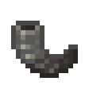
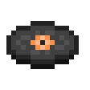

# Misc Items

::: warning Incomplete Article
This article is incomplete! So it may lack details or crucial information.
:::

## Compressed Copper

`vc:compressed_copper`
| Component | Value |
|---|---|
|Stackable|Yes (64)|
|Enchantable|No|
|Deals Damage|No|

### About:

## Cotton Ball

`vc:cotton_ball`
| Component | Value |
|---|---|
|Stackable|No|
|Enchantable|No|
|Deals Damage|No|

### About:

**Cotton Balls** are the offspring of [Cotton Plants](/items/crops.html#cotton-seeds)

    
 Leather  

  

    
 Cotton Ball  

    
 Cotton Ball  

    
 Cotton Ball  

    
 Cotton Ball  

    
 Honeycomb  

    
 Cotton Ball  

    
 Cotton Ball  

    
 Cotton Ball  

    
 Cotton Ball  

  

## Crystalized Experience

`vc:crystalized_experience`
| Component | Value |
|---|---|
|Stackable|Yes (64)|
|Enchantable|No|
|Deals Damage|No|

### About:

## Gloricalium Scrap

`vc:gloricalium_scrap`
| Component | Value |
|---|---|
|Stackable|No|
|Enchantable|No|
|Deals Damage|No|

### About:

## Gloricalium Sheet

`vc:gloricalium_sheet`
| Component | Value |
|---|---|
|Stackable|No|
|Enchantable|No|
|Deals Damage|No|

### About:

## Glorium Shard

`vc:glorium_shard`
| Component | Value |
|---|---|
|Stackable|Yes (64)|
|Enchantable|No|
|Deals Damage|No|

### About:

## Goat Horn (Roll)

`vc:goat_horn_roll`
|Component|Value|
|---|---|
|Stackable|No|
|Enchantable|No|
|Deals Damage|No (1)|
|Use Duration|204 Seconds (3:24)|

### About:

**Roll** is a brand new goat horn variant that can be found in [**Woodland Mansions**](https://minecraft.wiki/w/Woodland_Mansion)

- Unlike more goat horns, the audio will stop playing when the player stops using the item.
  - This is due to its unusually long length
- The goat horn was sampled and tuned by Vlliage
  - The sf2 can be downloaded [here](https://github.com/Villagecool/Vanilla-Upgrade-Public-Source/blob/main/RP/Vanilla%20Upgrade%20V3%20RP/sounds/item/horn/Goat%20Horn.sf2)
- The midi was created on onlinesequencer, I cannot find the original, however

### Sounds:

<audio controls>
  <source src="https://github.com/Villagecool/Vanilla-Upgrade-Public-Source/blob/main/RP/Vanilla%20Upgrade%20V3%20RP/sounds/item/horn/roll.ogg?raw=true" type="audio/ogg">
Your browser does not support the audio element.
</audio>

## Mist Music Disc

`vc:music_disc_mist`
| Component | Value |
|---|---|
|Stackable|No|
|Enchantable|No|
|Deals Damage|No|

### About:

**Mist** can be found in Dungeons, Wooland Mansions, or dropped Creepers shot by Strays

### Sounds:

<audio controls>
  <source src="https://github.com/Villagecool/Vanilla-Upgrade-Public-Source/blob/main/RP/Vanilla%20Upgrade%20V3%20RP/sounds/music/game/records/mist.ogg?raw=true" type="audio/ogg">
Your browser does not support the audio element.
</audio>

## Subhour Music Disc

`vc:music_disc_subhour`
| Component | Value |
|---|---|
|Stackable|No|
|Enchantable|No|
|Deals Damage|No|

### About:

- Used in the trailer
- Found in illusioner huts

### Sounds:

<audio controls>
  <source src="https://github.com/Villagecool/Vanilla-Upgrade-Public-Source/blob/main/RP/Vanilla%20Upgrade%20V3%20RP/sounds/music/game/records/subhour.ogg?raw=true" type="audio/ogg">
Your browser does not support the audio element.
</audio>

## Droopy Likes Your Face Music Disc

`vc:music_disc_droopy`
| Component | Value |
|---|---|
|Stackable|No|
|Enchantable|No|
|Deals Damage|No|

### About:

- Dropped by Creepers killed by Skeletons

### Sounds:

<audio controls>
  <source src="https://github.com/Villagecool/Vanilla-Upgrade-Public-Source/blob/main/RP/Vanilla%20Upgrade%20V3%20RP/sounds/music/game/records/droopy.ogg?raw=true" type="audio/ogg">
Your browser does not support the audio element.
</audio>

## Penguin Egg

`vc:penguin_egg`
| Component | Value |
|---|---|
|Stackable|Yes (64)|
|Enchantable|No|
|Deals Damage|No|

### About:

## Sparse Egg

`vc:sparse_egg`
| Component | Value |
|---|---|
|Stackable|Yes (64)|
|Enchantable|No|
|Deals Damage|No|

### About:

## Tumbleweed

`vc:tumbleweed`
| Component | Value |
|---|---|
|Stackable|Yes (64)|
|Enchantable|No|
|Deals Damage|No|

### About:

## Withered Bone

`vc:wither_bone`
| Component | Value |
|---|---|
|Stackable|Yes (64)|
|Enchantable|No|
|Deals Damage|No|

### About:

## Experience Orb

`vc:xp`
| Component | Value |
|---|---|
|Stackable|Yes (64)|
|Enchantable|No|
|Deals Damage|No|

### About:
