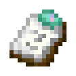
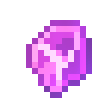
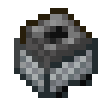
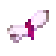
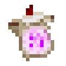
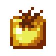

# Tool Items
::: warning Incomplete Article
This article is incomplete! So it may lack details or crucial information.
:::

## Advanced Filter <Badge type="danger">[**Advanced System**](/advanced_system.html)</Badge>

`vc:advanced_filter`
| Component | Value |
|---|---|
|Stackable|No|
|Enchantable|No|
|Deals Damage|No|

### About:
**Advanced Filters** are the base for a lot of the new **Advanced System** used in the add-on
- They are used to craft many of the new mechanichs
- On their own, they are also used to create **Specific Filters**
### The article over these items and tools can be found [**Here**](/advanced_system.html)

## Copper Wrench

`vc:copper_wrench`
|Component|Value|
|---|---|
|Stackable|No|
|Enchantable|Yes (10)|
|Deals Damage|Yes (4)|
|Max Durability|100|
|Damage Chance|5% - 10%|

### About

The **Copper Wrench** is a tool that can be used to rotate blocks 90 degrees
- When interacting with a block, if possible it will rotate 90 degrees clockwise along the y axis

### Crafting:

    
 Copper Wrench  

  

    

    
 Copper Ingot  

    

    

    
 Compressed Copper  

    

    

    
 Copper Ingot  

  

### Sounds
|Sound|Definition|Id|
|--|--|--|
<button class="sound-button" @click="playSound('https://github.com/Villagecool/Vanilla-Upgrade-Public-Source/blob/main/RP/sounds/random/wrench.ogg?raw=true')">🔊</button>|Wrench Rachets|random.wrench|

## Frozen Feather

`vc:frozen_feather`
| Component | Value |
|---|---|
|Stackable|No|
|Enchantable|No|
|Deals Damage|No|
|Use Duration|5|
|Max Durability|10|

### About:
**Frozen Feathers** are currently a drop from penguins, and are used to make  [**Crystalized Experience**](/items/misc.html#crystalized-experience).
- Putting  **Paper** in your mainhand, and the **Frozen Feather** in your offhand, the player will begin to write.
  - This will Extract experience from the player, turning it into Crystalized Experience
  - This system may be subject to change

### Sounds
|Sound|Definition|Id|
|--|--|--|
<button class="sound-button" @click="playSound('https://github.com/Villagecool/Vanilla-Upgrade-Public-Source/blob/main/RP/sounds/random/crystalize_xp.ogg?raw=true')">🔊</button>|XP crystalizes|random.crystalize_xp|

## Glareizer

`vc:glareizer`
| Component | Value |
|---|---|
|Stackable|No|
|Enchantable|Yes (14)|
|Deals Damage|No|
|Max Durability|250|

### About:
A **Glareizer** is a handheald contraption that tells the player how dark an area is.
- The darker an area is, the louder the glareizer will buzz
- Level 4 (the highest level) theoretically is where mobs are able to spawn

- Obiously, this is suppose to be a version of the [Glare](https://minecraft.wiki/w/Glare) in item form
- The Glareizer was inspired by the [Old EMF Reader](https://phasmophobia.fandom.com/wiki/EMF_Reader) in Phasmophobia
- The sounds were generated using [sfxr](https://sfxr.me/)

### Sounds
|Sound|Definition|Id|
|--|--|--|
<button class="sound-button" @click="playSound('https://github.com/Villagecool/Vanilla-Upgrade-Public-Source/blob/main/RP/sounds/item/glareizer/none.ogg?raw=true')">🔊</button>|Teir 0|glareizer.none|
<button class="sound-button" @click="playSound('https://github.com/Villagecool/Vanilla-Upgrade-Public-Source/blob/main/RP/sounds/item/glareizer/low.ogg?raw=true')">🔊</button>|Teir 1|glareizer.low|
<button class="sound-button" @click="playSound('https://github.com/Villagecool/Vanilla-Upgrade-Public-Source/blob/main/RP/sounds/item/glareizer/med.ogg?raw=true')">🔊</button>|Teir 2|glareizer.med|
<button class="sound-button" @click="playSound('https://github.com/Villagecool/Vanilla-Upgrade-Public-Source/blob/main/RP/sounds/item/glareizer/high.ogg?raw=true')">🔊</button>|Teir 3|glareizer.high|

## Dispenser Minecart

`vc:dispenser_minecart`
| Component | Value |
|---|---|
|Stackable|No|
|Enchantable|No|
|Deals Damage|No|

### About:
**Dispenser Minecarts** are exactally what they sound like, a dispenser in a minecart
- They are rapidly triggered by  [Activator Rails](https://minecraft.wiki/w/Activator_Rail)
- Many features may not work as expected due to bedrock addons being stupid 😔
- The item texture is just the   Minecart Furnace texture with a hole on top

## Potions

  <label class="radioswitcher">
    <input type="radio" name="radioswitcher" v-model="selectedPot" value="1">
        

Drinkable
  </label>
  <label class="radioswitcher">
    <input type="radio" name="radioswitcher" v-model="selectedPot" value="2">
        

Splash
  </label>
  <label class="radioswitcher">
    <input type="radio" name="radioswitcher" v-model="selectedPot" value="3">
        

Lingering
  </label>

<transition name="slide">
  

</transition>

## Rope

`vc:rope`
| Component | Value |
|---|---|
|Stackable|No|
|Enchantable|No|
|Deals Damage|No|

### About:
**Ropes** are a new block/item that can be used to climb up and down areas from a ceiling
- Interacting with the rope while holding another rope will result in pillaring down.
- Interacting otherwise will allow the player to climb up and down
  - Interact with a layer of rope to climb to that specific location
- Breaking a rope will have it reel in

### Crafting:

    
 Rope  

  

    

    
 String  

    

    
 String  

    
 Slimeball  

    
 String  

    

    
 String  

  

## Rotten Saddle

`vc:rotten_saddle`
|Component|Value|
|---|---|
|Stackable|No|
|Enchantable|No|
|Deals Damage|No (1)|
|Max Durability|10|
|Damage Chance||

### About
**Rotten Saddles** are a drop from the [Giant](/mobs.html#giant)
- When interacted with, a zombie horse will spawn for the player
- If you get off this horse, or it dies, the horse will despawn
- There is a 2 minute cooldown

## Rotten Tomato

`vc:rotten_tomato`
| Component | Value |
|---|---|
|Stackable|Yes (64)|
|Enchantable|No|
|Deals Damage|1-2 HP |

### About:
**WEAPONIZED VEGIETABLES**
- Rotten Tomatoes will sometimes come from [Tomato Plants](/items/crops.html#tomato-seeds)
- They can be trown
  - If one hits a block, it will stick

## Scroll

 

<code data-v-4a89f8d7="">vc:scroll</code>

<code data-v-4a89f8d7="">vc:unwritten_scroll</code>

| Component | Value |
|---|---|
|Stackable|No|
|Enchantable|No|
|Deals Damage|No|

### About:
**Scrolls** are part of the [Knowlage Harvester](/blocks/functional.html#knowlage-harvester)'s system
- When crafted, you will recieve an **Unwritten Scroll**
- As soon as an Unwritten Scroll is in your inventory, one of two things will happen
  - If you have an extra xp level to give, the Unwritten Scroll will turn into a normal **Scroll**, asorbing the level.
  - If you dont have enough xp, the Unwritten Scroll will turn back into  paper.
- **Scrolls** can be consumed to gen a level back

## Sled

`vc:sled`
| Component | Value |
|---|---|
|Stackable|No|
|Enchantable|No|
|Deals Damage|No|

### About:
**Sleds** can be placed down to ride in
- Sleds will accellerate when going downhill

### Crafting:

    
 Sled  

  

    

    

    

    

    

    
 Any Planks   

    
 Any Planks   

    
 Any Planks   

    
 Any Planks   

  

## Golden Tomato

`vc:tomato_golden`
| Component | Value |
|---|---|
|Stackable|Yes (64)|
|Enchantable|No|
|Deals Damage|6-8 HP ()|

### About:
**Golden Tomatoes** function very similarly to  [Rotten Tomatoes](#rotten-tomato), however dealing significantly more damage
- On collision, 2-8 of the golden nuggets used in the crafting recipie will break off.

### Crafting:

    
 Golden Tomato  

  

    
 Gold Nugget  

    
 Gold Nugget  

    
 Gold Nugget  

    
 Gold Nugget  

    
 Tomato  

    
 Gold Nugget  

    
 Gold Nugget  

    
 Gold Nugget  

    
 Gold Nugget  

  

## Totem Of Illusion

`vc:totem_of_illusion`
| Component | Value |
|---|---|
|Stackable|No|
|Enchantable|No|
|Deals Damage|No|

### About:
While Holding a **Totem of Illusion**, the totem will be consumed, and 6 identical clones of the player will be created.
  - These clones will wear the same armor, and tools the original player has (when used)
  - If the clone is alive for long enough, or if damaged, they will dissappear in a poof of smoke
- Totems of Illusion can be dropped from the [Illusioner](/mobs.html#illusioner)

### Sounds
|Sound|Definition|Id|
|--|--|--|
<button class="sound-button" @click="playSound('https://github.com/Villagecool/Vanilla-Upgrade-Public-Source/blob/main/RP/sounds/random/totem2.ogg?raw=true')">🔊</button>|Use Illusion Totem|random.totem2|
<button class="sound-button" @click="playSound('https://github.com/Villagecool/Vanilla-Upgrade-Public-Source/blob/main/RP/sounds/mob/player_clone/breathe.ogg?raw=true')">🔊</button>|Player Clone Breathes|mob.player_clone.idle|

## Wither Bone Meal

`vc:wither_bone_meal`
| Component | Value |
|---|---|
|Stackable|Yes (64)|
|Enchantable|No|
|Deals Damage|No|

### About:
**Wither Bone Meal** functions exactally like normal  **Bone Meal**, however, it exclusively works on   Nether Warts

