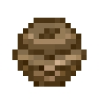
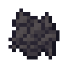
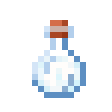
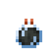

# Tool Items

## Advanced Filter

`vc:advanced_filter`
| Component | Value |
|---|---|
|Stackable|No|
|Enchantable|No|
|Deals Damage|No|

### About:

## Copper Wrench

`vc:copper_wrench`
|Component|Value|
|---|---|
|Stackable|No|
|Enchantable|Yes (10)|
|Deals Damage|Yes (4)|
|Max Durability|100|
|Damage Chance|5% - 10%|

### About

The copper wrench is a tool that can be used to rotate blocks 90 degrees

## Frozen Feather

`vc:frozen_feather`
| Component | Value |
|---|---|
|Stackable|No|
|Enchantable|No|
|Deals Damage|No|
|Use Duration|5|
|Max Durability|10|

### About:

## Glareizer

`vc:glareizer`
| Component | Value |
|---|---|
|Stackable|No|
|Enchantable|Yes (14)|
|Deals Damage|No|
|Max Durability|250|

### About:

## Dispenser Minecart

`vc:dispenser_minecart`
| Component | Value |
|---|---|
|Stackable|No|
|Enchantable|No|
|Deals Damage|No|

### About:

## Potions

  <label class="radioswitcher">
    <input type="radio" name="radioswitcher" v-model="selectedPot" value="1">
        

Drinkable
  </label>
  <label class="radioswitcher">
    <input type="radio" name="radioswitcher" v-model="selectedPot" value="2">
        

Splash
  </label>
  <label class="radioswitcher">
    <input type="radio" name="radioswitcher" v-model="selectedPot" value="3">
        

Lingering
  </label>

<transition name="slide">
  

</transition>

## Rope

`vc:rope`
| Component | Value |
|---|---|
|Stackable|No|
|Enchantable|No|
|Deals Damage|No|

### About:

## Rotten Tomato

`vc:rotten_tomato`
| Component | Value |
|---|---|
|Stackable|Yes (64)|
|Enchantable|No|
|Deals Damage|No|

### About:

## Unwritten Scroll

`vc:unwritten_scroll`
| Component | Value |
|---|---|
|Stackable|Yes (64)|
|Enchantable|No|
|Deals Damage|No|

### About:

## Sled

`vc:sled`
| Component | Value |
|---|---|
|Stackable|No|
|Enchantable|No|
|Deals Damage|No|

### About:

## Golden Tomato

`vc:tomato_golden`
| Component | Value |
|---|---|
|Stackable|Yes (64)|
|Enchantable|No|
|Deals Damage|No|

### About:

## Totem Of Illusion

`vc:totem_of_illusion`
| Component | Value |
|---|---|
|Stackable|No|
|Enchantable|No|
|Deals Damage|No|

### About:

## Wither Bone Meal

`vc:wither_bone_meal`
| Component | Value |
|---|---|
|Stackable|Yes (64)|
|Enchantable|No|
|Deals Damage|No|

### About:

