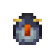
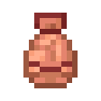

# Mobs
::: warning Incomplete Article
This article is incomplete! So it may lack details or crucial information.

Reason: some mob descriptions could be explained better with more visuals
:::

## Bandager 

`vc:bandager`
|Component|Value|
|--|--|
|Health points|24HP ( × 12)|
|Behavior|Hostile|
|Mob type|Illager, Monster|
|Attack strength|**Melee**: 5HP  **Ranged**: Easy and normal: 2HP  – 5HP  Hard: 3HP  – 5HP |
|Drops||

**Bandagers** are illagers that have been thrown into the Badlands
- They are found in [Saloons](/features.html#saloons)
  - Rather than alcohol, these guys love drinking  [Cocojuice](/items/food.html#cocojuice)
- They are easily aggitated, and will attack **eachother** when provoked
- Similar to [Piglins](https://minecraft.wiki/w/Piglin) and have Melee and Ranged variants  (Sporting a  Gold Picaxe or  Bow respectively)
- Their design is somewhat based off the old Pillager texture
- Bandagers originated from one of my old unreleased addons, titled *More Illagers*

### Sounds
|Sound|Definition|Id|
|--|--|--|
<button class="sound-button" @click="playSound('https://github.com/Villagecool/Vanilla-Upgrade-Public-Source/blob/main/RP/Vanilla%20Upgrade%20V3%20RP/sounds/mob/bandager/idle1.ogg?raw=true')">🔊</button><button class="sound-button" @click="playSound('https://github.com/Villagecool/Vanilla-Upgrade-Public-Source/blob/main/RP/Vanilla%20Upgrade%20V3%20RP/sounds/mob/bandager/idle2.ogg?raw=true')">🔊</button><button class="sound-button" @click="playSound('https://github.com/Villagecool/Vanilla-Upgrade-Public-Source/blob/main/RP/Vanilla%20Upgrade%20V3%20RP/sounds/mob/bandager/idle3.ogg?raw=true')">🔊</button>|Idle|mob.bandager.idle
<button class="sound-button" @click="playSound('https://github.com/Villagecool/Vanilla-Upgrade-Public-Source/blob/main/RP/Vanilla%20Upgrade%20V3%20RP/sounds/mob/bandager/hurt1.ogg?raw=true')">🔊</button><button class="sound-button" @click="playSound('https://github.com/Villagecool/Vanilla-Upgrade-Public-Source/blob/main/RP/Vanilla%20Upgrade%20V3%20RP/sounds/mob/bandager/hurt2.ogg?raw=true')">🔊</button><button class="sound-button" @click="playSound('https://github.com/Villagecool/Vanilla-Upgrade-Public-Source/blob/main/RP/Vanilla%20Upgrade%20V3%20RP/sounds/mob/bandager/hurt3.ogg?raw=true')">🔊</button>|Hurt|mob.bandager.hurt
<button class="sound-button" @click="playSound('https://github.com/Villagecool/Vanilla-Upgrade-Public-Source/blob/main/RP/Vanilla%20Upgrade%20V3%20RP/sounds/mob/bandager/death.ogg?raw=true')">🔊</button>|Death|mob.bandager.death

## Giant 

`vc:giant`
|Component|Value|
|--|--|
|Health points|200HP ( × 100)|
|Behavior|Hostile|
|Mob type|Zombie, Undead, Monster|
|Attack strength|3HP |
|Drops||

The **Giant Zombie** is a boss mob that spawns from a brand new [Ominous Event](https://minecraft.wiki/w/Ominous_Event)
### Spawning the Giant
1. Drink a  [Ominous Bottle](https://minecraft.wiki/w/Ominous_Bottle)
2. Break a  [Monster Spawner](https://minecraft.wiki/w/Monster_Spawner)
3. This will turn your  Bad Omen into  **Giant Omen** (Lasting 0:30-2:00)
    <Badge type="warning" text="Due to bedrock limitations, this will not visually show in game."/>
4. After the effect wears off, a giant will emerge from the ground 20-100 blocks away from the victim's location.

### The Giant's attacks
- After the giant is spawned, it will begin attacking whatever a normal zombie would attack.
- The Giant can step on it's victims, or quickly punch them.
  - Punching the ground will also cause a small shockwave in the ground
  - If the giant is below 50% health, the shockwave will be more intense
- On occasion, it can also stomp on the ground, summoning about 13 normal zombies
### On death
- The giant zombie will begin to glow and tweaking.
- Eventually it will shrink down to a normal size and explode into a pile of  Experience and  Rotten Flesh
- A  [Rotten Saddle](/items/tools.html#rotten-saddle) will be rewarded to the player.

### Sounds
|Sound|Definition|Id|
|--|--|--|
<button class="sound-button" @click="playSound('https://github.com/Villagecool/Vanilla-Upgrade-Public-Source/blob/main/RP/Vanilla%20Upgrade%20V3%20RP/sounds/mob/giant/idle1.ogg?raw=true')">🔊</button><button class="sound-button" @click="playSound('https://github.com/Villagecool/Vanilla-Upgrade-Public-Source/blob/main/RP/Vanilla%20Upgrade%20V3%20RP/sounds/mob/giant/idle2.ogg?raw=true')">🔊</button><button class="sound-button" @click="playSound('https://github.com/Villagecool/Vanilla-Upgrade-Public-Source/blob/main/RP/Vanilla%20Upgrade%20V3%20RP/sounds/mob/giant/idle3.ogg?raw=true')">🔊</button>|Idle|mob.giant.idle
<button class="sound-button" @click="playSound('https://github.com/Villagecool/Vanilla-Upgrade-Public-Source/blob/main/RP/Vanilla%20Upgrade%20V3%20RP/sounds/mob/giant/hurt1.ogg?raw=true')">🔊</button><button class="sound-button" @click="playSound('https://github.com/Villagecool/Vanilla-Upgrade-Public-Source/blob/main/RP/Vanilla%20Upgrade%20V3%20RP/sounds/mob/giant/hurt2.ogg?raw=true')">🔊</button>|Hurt|mob.giant.hurt
<button class="sound-button" @click="playSound('https://github.com/Villagecool/Vanilla-Upgrade-Public-Source/blob/main/RP/Vanilla%20Upgrade%20V3%20RP/sounds/mob/giant/big-guy-dies.ogg?raw=true')">🔊</button>|Death|mob.giant.death
<button class="sound-button" @click="playSound('https://github.com/Villagecool/Vanilla-Upgrade-Public-Source/blob/main/RP/Vanilla%20Upgrade%20V3%20RP/sounds/mob/giant/attack1.ogg?raw=true')">🔊</button><button class="sound-button" @click="playSound('https://github.com/Villagecool/Vanilla-Upgrade-Public-Source/blob/main/RP/Vanilla%20Upgrade%20V3%20RP/sounds/mob/giant/attack2.ogg?raw=true')">🔊</button><button class="sound-button" @click="playSound('https://github.com/Villagecool/Vanilla-Upgrade-Public-Source/blob/main/RP/Vanilla%20Upgrade%20V3%20RP/sounds/mob/giant/attack3.ogg?raw=true')">🔊</button>|Attack|mob.giant.attack
<button class="sound-button" @click="playSound('https://github.com/Villagecool/Vanilla-Upgrade-Public-Source/blob/main/RP/Vanilla%20Upgrade%20V3%20RP/sounds/mob/giant/scream.ogg?raw=true')">🔊</button>|Scream|mob.giant.scream
<button class="sound-button" @click="playSound('https://github.com/Villagecool/Vanilla-Upgrade-Public-Source/blob/main/RP/Vanilla%20Upgrade%20V3%20RP/sounds/mob/giant/loud-explosion.ogg?raw=true')">🔊</button>|Explode|mob.giant.explode

## Illusioner 

`vc:llusioner`
|Component|Value|
|--|--|
|Health points|180-190HP ( × 90)|
|Behavior|Hostile|
|Mob type|Illager, Monster|
|Attack strength|Easy and normal: 2HP  – 5HP  Hard: 3HP  – 5HP |
|Drops||

**Illusioners** were designed to represent both their [Java Edition](https://minecraft.wiki/w/Illusioner) and [Dungeons](https://minecraft.wiki/w/Dungeons:Illusioner) counterparts.
- They are found in [Illusioner Huts](/features.html#illusioner-hut)
- When attacking, it will shoot players, and village related mobs with it's bow
- It can also preform one of two spells
  1. Give  blindness to nearby players 
  2. Spawn Clones of itself
    - When spawned, the original Illusioner disappears and will teleport nearby. Afterward it will gradually reappear along with the other clones.
    - The clones do not do any actual damage to it's target (the hurt animation will still play however)
    
- After it is defeated, the Illusioner will drop a  [Totem of Illusion](/items/tools.html#totem-of-illusion)
- Illusioners will attempt to turn [Red Sheep](https://minecraft.wiki/w/Sheep#Easter_eggs) to become blue, opposing the Evoker

### Sounds
|Sound|Definition|Id|
|--|--|--|
<button class="sound-button" @click="playSound('https://github.com/Villagecool/Vanilla-Upgrade-Public-Source/blob/main/RP/Vanilla%20Upgrade%20V3%20RP/sounds/mob/illusioner/idle1.ogg?raw=true')">🔊</button><button class="sound-button" @click="playSound('https://github.com/Villagecool/Vanilla-Upgrade-Public-Source/blob/main/RP/Vanilla%20Upgrade%20V3%20RP/sounds/mob/illusioner/idle2.ogg?raw=true')">🔊</button><button class="sound-button" @click="playSound('https://github.com/Villagecool/Vanilla-Upgrade-Public-Source/blob/main/RP/Vanilla%20Upgrade%20V3%20RP/sounds/mob/illusioner/idle3.ogg?raw=true')">🔊</button><button class="sound-button" @click="playSound('https://github.com/Villagecool/Vanilla-Upgrade-Public-Source/blob/main/RP/Vanilla%20Upgrade%20V3%20RP/sounds/mob/illusioner/idle4.ogg?raw=true')">🔊</button>|Idle|mob.illusioner.idle
<button class="sound-button" @click="playSound('https://github.com/Villagecool/Vanilla-Upgrade-Public-Source/blob/main/RP/Vanilla%20Upgrade%20V3%20RP/sounds/mob/illusioner/hurt1.ogg?raw=true')">🔊</button><button class="sound-button" @click="playSound('https://github.com/Villagecool/Vanilla-Upgrade-Public-Source/blob/main/RP/Vanilla%20Upgrade%20V3%20RP/sounds/mob/illusioner/hurt2.ogg?raw=true')">🔊</button><button class="sound-button" @click="playSound('https://github.com/Villagecool/Vanilla-Upgrade-Public-Source/blob/main/RP/Vanilla%20Upgrade%20V3%20RP/sounds/mob/illusioner/hurt3.ogg?raw=true')">🔊</button>|Hurt|mob.illusioner.hurt
<button class="sound-button" @click="playSound('https://github.com/Villagecool/Vanilla-Upgrade-Public-Source/blob/main/RP/Vanilla%20Upgrade%20V3%20RP/sounds/mob/illusioner/death1.ogg?raw=true')">🔊</button><button class="sound-button" @click="playSound('https://github.com/Villagecool/Vanilla-Upgrade-Public-Source/blob/main/RP/Vanilla%20Upgrade%20V3%20RP/sounds/mob/illusioner/death2.ogg?raw=true')">🔊</button>|Death|mob.illusioner.death
<button class="sound-button" @click="playSound('https://github.com/Villagecool/Vanilla-Upgrade-Public-Source/blob/main/RP/Vanilla%20Upgrade%20V3%20RP/sounds/mob/illusioner/mirror_move1.ogg?raw=true')">🔊</button><button class="sound-button" @click="playSound('https://github.com/Villagecool/Vanilla-Upgrade-Public-Source/blob/main/RP/Vanilla%20Upgrade%20V3%20RP/sounds/mob/illusioner/mirror_move2.ogg?raw=true')">🔊</button>|Mirror Move|mob.illusioner.mirror_move
<button class="sound-button" @click="playSound('https://github.com/Villagecool/Vanilla-Upgrade-Public-Source/blob/main/RP/Vanilla%20Upgrade%20V3%20RP/sounds/mob/illusioner/prepare_mirror.ogg?raw=true')">🔊</button>|Prepare Mirror Move|mob.illusioner.prepare_mirror
<button class="sound-button" @click="playSound('https://github.com/Villagecool/Vanilla-Upgrade-Public-Source/blob/main/RP/Vanilla%20Upgrade%20V3%20RP/sounds/mob/illusioner/prepare_blind.ogg?raw=true')">🔊</button>|Prepare Blindness|mob.illusioner.prepare_blind

## Melon Golem 

`vc:melon_golem`

|Component|Value|
|--|--|
|Health points|4HP ( × 2)|
|Behavior|Neutral|
|Mob type|Golem|
|Attack strength|1HP |
|Drops||

**Melon Golems** are a new variant of [Snow Golem](https://minecraft.wiki/w/Snow_Golem) that originates from [Minecraft Earth](https://minecraft.wiki/w/Earth:Melon_Golem)
- They can be spawned by placing a  Carved Melon or  Glistening Carved Melon onto snow blocks.
- They will spit seeds at their targets, unless the melon they are wearing is sheared off.
### Sounds
* Melon Golems just use [Snow Golem sounds](https://minecraft.wiki/w/Snow_Golem#Sounds)

## Penguin 

`vc:penguin`

|Component|Value|
|--|--|
|Health points|10HP ( × 5)|
|Behavior|Passive|
|Mob type|Animal|
|Drops||

**Penguins** are animals that are found in **artic** regions.
- There are two variants of penguin, sliders and waddlers.
  - Slider penguins are much faster in movement and slide on their bellies
  - Waddlers will waddle around
- They both swim in water and walk on land
- They like to eat all types of  Fish
  - You can tame penguins by feeding them fish, and they will follow you around
- When swimming they will randomly fish up  **Raw Cod**

### Sounds
|Sound|Definition|Id|
|--|--|--|
<button class="sound-button" @click="playSound('https://github.com/Villagecool/Vanilla-Upgrade-Public-Source/blob/main/RP/Vanilla%20Upgrade%20V3%20RP/sounds/mob/penguin/S3_sfx_pet_RoyalPenguin_vocal_01.ogg?raw=true')">🔊</button><button class="sound-button" @click="playSound('https://github.com/Villagecool/Vanilla-Upgrade-Public-Source/blob/main/RP/Vanilla%20Upgrade%20V3%20RP/sounds/mob/penguin/S3_sfx_pet_RoyalPenguin_vocal_02.ogg?raw=true')">🔊</button><button class="sound-button" @click="playSound('https://github.com/Villagecool/Vanilla-Upgrade-Public-Source/blob/main/RP/Vanilla%20Upgrade%20V3%20RP/sounds/mob/penguin/S3_sfx_pet_RoyalPenguin_vocal_03.ogg?raw=true')">🔊</button><button class="sound-button" @click="playSound('https://github.com/Villagecool/Vanilla-Upgrade-Public-Source/blob/main/RP/Vanilla%20Upgrade%20V3%20RP/sounds/mob/penguin/bleat.ogg?raw=true')">🔊</button>|Bleat|mob.penguin.bleat

## Sparse 

`vc:sparse`

|Component|Value|
|--|--|
|Health points|35HP ( × 17.5)|
|Behavior|Passive|
|Mob type|Animal|
|Drops||

**Sparse** the sparse is a new anchient animal that has  eggs found in [Saloons](/features.html#saloons)
- They can go up to leaves and grab **Ancient Fruits** every minute or so

- When fed these fruits (and other fruits in the game) and milked with a  [Coconut Slice](/items/food.html#coconut-slice) will provide  [***Spiked* Cocojuice**](/items/food.html#cocojuice)
- Here is a chart of all the effects you can get

|Fruit|Spiked Cocojuice Effect|
|--|--|
|Temporarily Restores you to full health|
|Gives Speed IV for 5 seconds, afterward gives Slowness (random level) for 5 seonds|
|Gives haste IV, Hunger (random level) and Oozing|
|For 50 seconds, Strength 20 will be given for a random amount of time for the remaining time, Blindness and Slowness will be given
|Makes the user spit a seed|
|Gives Slow Falling IV and a random level of Weakness for 50 seconds
|Gives Jump Boost IV and a random level of Slowness for 50 seconds
|Gives Regeneration II-III and set the user on fire for 60 seconds
|Gives Water Breathing and Nausea for 500 seconds
|Teleports the user 5 blocks away from where they are standing

### Sounds
|Sound|Definition|Id|
|--|--|--|
<button class="sound-button" @click="playSound('https://github.com/Villagecool/Vanilla-Upgrade-Public-Source/blob/main/RP/Vanilla%20Upgrade%20V3%20RP/sounds/mob/sparse/idle1.ogg?raw=true')">🔊</button><button class="sound-button" @click="playSound('https://github.com/Villagecool/Vanilla-Upgrade-Public-Source/blob/main/RP/Vanilla%20Upgrade%20V3%20RP/sounds/mob/sparse/idle2.ogg?raw=true')">🔊</button><button class="sound-button" @click="playSound('https://github.com/Villagecool/Vanilla-Upgrade-Public-Source/blob/main/RP/Vanilla%20Upgrade%20V3%20RP/sounds/mob/sparse/idle3.ogg?raw=true')">🔊</button><button class="sound-button" @click="playSound('https://github.com/Villagecool/Vanilla-Upgrade-Public-Source/blob/main/RP/Vanilla%20Upgrade%20V3%20RP/sounds/mob/sparse/idle4.ogg?raw=true')">🔊</button><button class="sound-button" @click="playSound('https://github.com/Villagecool/Vanilla-Upgrade-Public-Source/blob/main/RP/Vanilla%20Upgrade%20V3%20RP/sounds/mob/sparse/idle5.ogg?raw=true')">🔊</button><button class="sound-button" @click="playSound('https://github.com/Villagecool/Vanilla-Upgrade-Public-Source/blob/main/RP/Vanilla%20Upgrade%20V3%20RP/sounds/mob/sparse/idle6.ogg?raw=true')">🔊</button>|Idle|mob.sparse.say
<button class="sound-button" @click="playSound('https://github.com/Villagecool/Vanilla-Upgrade-Public-Source/blob/main/RP/Vanilla%20Upgrade%20V3%20RP/sounds/mob/sparse/hit1.ogg?raw=true')">🔊</button><button class="sound-button" @click="playSound('https://github.com/Villagecool/Vanilla-Upgrade-Public-Source/blob/main/RP/Vanilla%20Upgrade%20V3%20RP/sounds/mob/sparse/hit2.ogg?raw=true')">🔊</button><button class="sound-button" @click="playSound('https://github.com/Villagecool/Vanilla-Upgrade-Public-Source/blob/main/RP/Vanilla%20Upgrade%20V3%20RP/sounds/mob/sparse/hit3.ogg?raw=true')">🔊</button><button class="sound-button" @click="playSound('https://github.com/Villagecool/Vanilla-Upgrade-Public-Source/blob/main/RP/Vanilla%20Upgrade%20V3%20RP/sounds/mob/sparse/hit4.ogg?raw=true')">🔊</button>|Hurt|mob.sparse.hurt
<button class="sound-button" @click="playSound('https://github.com/Villagecool/Vanilla-Upgrade-Public-Source/blob/main/RP/Vanilla%20Upgrade%20V3%20RP/sounds/mob/sparse/death1.ogg?raw=true')">🔊</button><button class="sound-button" @click="playSound('https://github.com/Villagecool/Vanilla-Upgrade-Public-Source/blob/main/RP/Vanilla%20Upgrade%20V3%20RP/sounds/mob/sparse/death2.ogg?raw=true')">🔊</button><button class="sound-button" @click="playSound('https://github.com/Villagecool/Vanilla-Upgrade-Public-Source/blob/main/RP/Vanilla%20Upgrade%20V3%20RP/sounds/mob/sparse/death3.ogg?raw=true')">🔊</button>|Death|mob.sparse.death
<button class="sound-button" @click="playSound('https://github.com/Villagecool/Vanilla-Upgrade-Public-Source/blob/main/RP/Vanilla%20Upgrade%20V3%20RP/sounds/mob/sparse/search1.ogg?raw=true')">🔊</button><button class="sound-button" @click="playSound('https://github.com/Villagecool/Vanilla-Upgrade-Public-Source/blob/main/RP/Vanilla%20Upgrade%20V3%20RP/sounds/mob/sparse/search2.ogg?raw=true')">🔊</button><button class="sound-button" @click="playSound('https://github.com/Villagecool/Vanilla-Upgrade-Public-Source/blob/main/RP/Vanilla%20Upgrade%20V3%20RP/sounds/mob/sparse/search3.ogg?raw=true')">🔊</button><button class="sound-button" @click="playSound('https://github.com/Villagecool/Vanilla-Upgrade-Public-Source/blob/main/RP/Vanilla%20Upgrade%20V3%20RP/sounds/mob/sparse/search4.ogg?raw=true')">🔊</button>|Search for fruit|mob.sparse.search
<button class="sound-button" @click="playSound('https://github.com/Villagecool/Vanilla-Upgrade-Public-Source/blob/main/RP/Vanilla%20Upgrade%20V3%20RP/sounds/mob/sparse/find1.ogg?raw=true')">🔊</button><button class="sound-button" @click="playSound('https://github.com/Villagecool/Vanilla-Upgrade-Public-Source/blob/main/RP/Vanilla%20Upgrade%20V3%20RP/sounds/mob/sparse/find2.ogg?raw=true')">🔊</button><button class="sound-button" @click="playSound('https://github.com/Villagecool/Vanilla-Upgrade-Public-Source/blob/main/RP/Vanilla%20Upgrade%20V3%20RP/sounds/mob/sparse/find3.ogg?raw=true')">🔊</button>|Found Fruit|mob.sparse.find

## Termite 

`vc:termite`

|Component|Value|
|--|--|
|Health points|8HP ( × 4)|
|Behavior|Passive|
|Mob type|Animal|
|Drops||

**Termites** spawn is Deserts in colonies
- Termites will go out and grab blocks of wood to take back to their  **Nest**
- They are found in [Termite Mounds](/features.html#termite-mound) in the desert
  - They do not use wood that is not from **The Overworld**
  - The wood they collect can be harvested with a  [Hopper](https://minecraft.wiki/w/Hopper) under the nest
- Termites named "Toymite" will eat as much wood as they possibly can and won't go back to their nest
  - This is a refrence to an episode of [Popeye the Salor Man](https://en.wikipedia.org/wiki/Popeye) where termites ruthlessly attack his house

### Sounds
* Termites just use [Silverfish sounds](https://minecraft.wiki/w/Silverfish#Sounds)

## Tumbleweed 

`vc:tumbleweed`

**Tumbleweeds** just travel in a straight line until they hit something, then they burst into sticks.

|Component|Value|
|--|--|
|Health points|50HP ( × 25)|
|Behavior|Hostile|
|Mob type|Inanimate|
|Attack strength|4HP |
|Drops||

## Copper Golem  <Badge type="danger" text="Removed"/>

`vc:copper_golem`

|Component|Value|
|--|--|
|Health points|16HP ( × 8)|
|Behavior|Passive|
|Mob type|Golem|
|Drops||

::: danger Removed
The copper golem was removed in v3.1.0 due to the base game copper golem being announced
:::

**Copper Golems** were a lackluster implementation of the Mob from the 2021 Mob vote
- They were intended to run up and press buttons
  - This feature was not able to be well implemented
- If oxidized, they would begin to slow in movement
- This could be countered by waxing the golem
- They could be created by stacking a Lightning Rod on a Block of Compressed Copper
- The copper golem's sound were created using a [Copper Block AI Filter](https://weights.gg) (This has been removed from the site)

- After being removed in v3.1.0, many of the Copper Golem's files are still present in the source code. It either been commented out, or put in the "stuff deemed unworthy" folder.

### Sounds
|Sound|Definition|Id|
|--|--|--|
<button class="sound-button" @click="playSound('https://github.com/Villagecool/Vanilla-Upgrade-Public-Source/blob/main/RP/Vanilla%20Upgrade%20V3%20RP/sounds/mob/copper_golem/idle1.ogg?raw=true')">🔊</button><button class="sound-button" @click="playSound('https://github.com/Villagecool/Vanilla-Upgrade-Public-Source/blob/main/RP/Vanilla%20Upgrade%20V3%20RP/sounds/mob/copper_golem/idle2.ogg?raw=true')">🔊</button><button class="sound-button" @click="playSound('https://github.com/Villagecool/Vanilla-Upgrade-Public-Source/blob/main/RP/Vanilla%20Upgrade%20V3%20RP/sounds/mob/copper_golem/idle3.ogg?raw=true')">🔊</button><button class="sound-button" @click="playSound('https://github.com/Villagecool/Vanilla-Upgrade-Public-Source/blob/main/RP/Vanilla%20Upgrade%20V3%20RP/sounds/mob/copper_golem/idle4.ogg?raw=true')">🔊</button><button class="sound-button" @click="playSound('https://github.com/Villagecool/Vanilla-Upgrade-Public-Source/blob/main/RP/Vanilla%20Upgrade%20V3%20RP/sounds/mob/copper_golem/idle5.ogg?raw=true')">🔊</button>|Idle|mob.copper_golem.idle
<button class="sound-button" @click="playSound('https://github.com/Villagecool/Vanilla-Upgrade-Public-Source/blob/main/RP/Vanilla%20Upgrade%20V3%20RP/sounds/mob/copper_golem/hit1.ogg?raw=true')">🔊</button><button class="sound-button" @click="playSound('https://github.com/Villagecool/Vanilla-Upgrade-Public-Source/blob/main/RP/Vanilla%20Upgrade%20V3%20RP/sounds/mob/copper_golem/hit2.ogg?raw=true')">🔊</button><button class="sound-button" @click="playSound('https://github.com/Villagecool/Vanilla-Upgrade-Public-Source/blob/main/RP/Vanilla%20Upgrade%20V3%20RP/sounds/mob/copper_golem/hit3.ogg?raw=true')">🔊</button><button class="sound-button" @click="playSound('https://github.com/Villagecool/Vanilla-Upgrade-Public-Source/blob/main/RP/Vanilla%20Upgrade%20V3%20RP/sounds/mob/copper_golem/hit4.ogg?raw=true')">🔊</button>|Hurt|mob.copper_golem.hurt
<button class="sound-button" @click="playSound('https://github.com/Villagecool/Vanilla-Upgrade-Public-Source/blob/main/RP/Vanilla%20Upgrade%20V3%20RP/sounds/mob/copper_golem/death1.ogg?raw=true')">🔊</button><button class="sound-button" @click="playSound('https://github.com/Villagecool/Vanilla-Upgrade-Public-Source/blob/main/RP/Vanilla%20Upgrade%20V3%20RP/sounds/mob/copper_golem/death2.ogg?raw=true')">🔊</button>|Death|mob.copper_golem.death
<button class="sound-button" @click="playSound('https://github.com/Villagecool/Vanilla-Upgrade-Public-Source/blob/main/RP/Vanilla%20Upgrade%20V3%20RP/sounds/mob/copper_golem/scrape1.ogg?raw=true')">🔊</button><button class="sound-button" @click="playSound('https://github.com/Villagecool/Vanilla-Upgrade-Public-Source/blob/main/RP/Vanilla%20Upgrade%20V3%20RP/sounds/mob/copper_golem/scrape2.ogg?raw=true')">🔊</button><button class="sound-button" @click="playSound('https://github.com/Villagecool/Vanilla-Upgrade-Public-Source/blob/main/RP/Vanilla%20Upgrade%20V3%20RP/sounds/mob/copper_golem/scrape3.ogg?raw=true')">🔊</button><button class="sound-button" @click="playSound('https://github.com/Villagecool/Vanilla-Upgrade-Public-Source/blob/main/RP/Vanilla%20Upgrade%20V3%20RP/sounds/mob/copper_golem/scrape4.ogg?raw=true')">🔊</button>|Scrape|mob.copper_golem.releif

<!-- ## t
# Test
### Sounds
|Sound|Definition|Id|
|--|--|--|
<button class="sound-button" @click="playSound('https://www.myinstants.com/media/sounds/vine-boom.mp3')">🔊</button> <button class="sound-button" @click="playSound('https://www.myinstants.com/media/sounds/vine-boom.mp3')">🔊</button><button class="sound-button" @click="playSound('https://www.myinstants.com/media/sounds/vine-boom.mp3')">🔊</button> <button class="sound-button" @click="playSound('https://www.myinstants.com/media/sounds/vine-boom.mp3')">🔊</button><button class="sound-button" @click="playSound('https://www.myinstants.com/media/sounds/vine-boom.mp3')">🔊</button> <button class="sound-button" @click="playSound('https://www.myinstants.com/media/sounds/vine-boom.mp3')">🔊</button>|a|a|
<button class="sound-button" @click="playSound('https://www.myinstants.com/media/sounds/vine-boom.mp3')">🔊</button> <button class="sound-button" @click="playSound('https://www.myinstants.com/media/sounds/vine-boom.mp3')">🔊</button> | Test | test.test.test |
<button class="sound-button" @click="playSound('https://www.myinstants.com/media/sounds/tuco-get-out.mp3')">🔊</button> | GET OUT | get.out
-->

